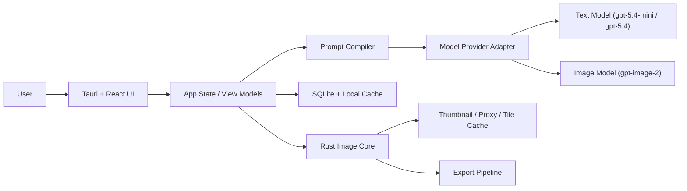

# GPT-Image-2 Windows Photo Editor

Version: v0.4
Date: 2026-05-17
Status: Draft, updated with MVP2, MVP3, and MVP4 planning

## 1. Document Purpose

This document consolidates the product requirements and detailed technical design for a Windows-first AI photo editing application built around `gpt-image-2`. The product is designed for photographers and image creators who work with large PNG images and want to perform prompt-driven edits efficiently on desktop.

The document covers:

- product goals and scope
- target users and usage scenarios
- feature requirements for the MVP and later phases
- technical architecture for a Windows-first, macOS-ready desktop application
- large-image processing strategy
- prompt compilation strategy
- data model, module design, and API abstraction
- UI approach based on `Tauri + React + shadcn/ui + Radix UI + Tailwind CSS`
- MVP4 Chinese internationalization and prompt center scope
- development milestones and risk assessment

## 2. Product Summary

### 2.1 Product Positioning

The product is an AI-assisted desktop photo editor focused on:

- prompt-based photo editing
- mask-based local edits
- large-image friendly workflows
- BYOK configuration with `baseURL + API key`
- photography-oriented editing rather than pure AI image generation

It is not positioned as a full replacement for Photoshop, Capture One, or Lightroom in traditional RAW and pixel-level workflows. Instead, it focuses on "content-aware AI editing" on top of a local desktop workflow.

### 2.2 Core Value

The product should help users quickly complete edits such as:

- removing unwanted people or objects
- repairing sky, clouds, water, vegetation, and background details
- changing atmosphere, season, or weather
- adjusting visual tone through prompt-driven edits
- applying edits to high-resolution source images without losing the local-desktop workflow
- making the desktop workflow accessible in both English and Simplified Chinese
- reusing high-quality generation and editing prompts through a searchable local prompt center

### 2.3 Platform Strategy

Phase 1 targets Windows.

The architecture must remain compatible with a future macOS release by using:

- `Tauri 2` for the desktop shell
- `React + TypeScript` for UI
- `Rust` for native image-processing modules
- `libvips` for large image handling

## 3. Product Goals

### 3.1 Goals

- Provide a usable Windows desktop application for prompt-based image editing.
- Support large PNG photography assets, often around `36MB` per image.
- Minimize upload cost and latency by editing proxy images or local regions when possible.
- Support both global edit mode and mask-based local edit mode.
- Allow users to configure `baseURL`, `API key`, and model settings locally.
- Default to a client-direct BYOK architecture without requiring a server.
- Support a future macOS version without major architectural rework.

### 3.2 Non-Goals for MVP

- RAW pipeline support
- advanced color grading curves
- frequency separation or precision retouching tools
- Photoshop-grade layer compositing
- multi-user collaboration
- cloud sync
- billing, quota management, or team administration
- plugin marketplace

## 4. Target Users

### 4.1 Primary Users

- photographers
- wedding and portrait editors
- landscape photographers
- content creators managing large photo libraries

### 4.2 User Characteristics

- work with large local image files
- want faster iteration than manual compositing
- may not want to run a self-hosted backend
- may prefer using their own model provider credentials

## 5. Core Use Cases

### 5.1 General Use Cases

- import a folder of large PNG images
- browse thumbnails quickly
- open a single image for inspection and editing
- paint a mask over a region
- enter a prompt such as "remove the tourists and keep the water reflection natural"
- generate a draft result quickly
- compare before and after
- accept the result and export the image
- generate a brand-new image from a text prompt without an input photo (see [§31](#31-image-generation-mode))

### 5.2 Landscape Photo Use Cases

- remove power lines, people, signs, boats, trash bins
- enhance clouds and sky texture while preserving realism
- add fog or sunrise atmosphere
- clean the frame edges and foreground clutter
- repair local areas such as water reflections or mountain texture

### 5.3 Portrait and Event Use Cases

- remove distracting background objects
- repair clothing wrinkles or missing details
- replace minor scene elements
- preserve face shape, skin tone, pose, and dress texture

## 6. Product Scope

### 6.1 MVP Features

- local image import from folders
- thumbnail generation and browsing
- single-image viewer
- zoom and pan
- brush-based mask editing
- prompt input panel
- AI edit action with draft and final quality presets
- side-by-side compare view
- history of edit versions per image
- export to PNG or JPEG
- settings page with `baseURL`, `API key`, image model, and text model
- text-to-image generation mode with persistent gallery (see [§31](#31-image-generation-mode))

### 6.2 MVP2 Social Landscape Edition

MVP2 focuses on real personal use rather than commercial high-fidelity delivery:

- primary scenario: landscape photography
- secondary scenario: light portrait retouching
- target output: social sharing, especially WeChat Moments and mobile viewing
- acceptable output file size: usually `5MB` to `8MB`
- preferred workflow: compressed upload proxy editing, not original-size crop-stitch editing

MVP2 features:

- configurable upload proxy quality profiles
- default recommended edit proxy around `4096px` long edge and `<=8MB`
- keep image edit API `size` as `auto`; do not expose 1K, 2K, or 4K controls during editing
- social export presets such as WeChat Moments, high-quality mobile, and custom JPEG
- landscape prompt presets for natural clarity, sky detail, sunset glow, cool blue tone, mountain texture, water reflection, green recovery, and night scene cleanup
- light portrait presets focused on natural skin, identity preservation, background cleanup, and soft atmosphere
- reusable prompt presets and prompt history
- small batch edit queue for selected photos using the same prompt or preset
- better before/after comparison for color, detail, and composition review
- Rust-side provider compatibility check to avoid frontend CORS issues
- Windows Credential Manager or equivalent secure key storage before public beta

MVP2 explicitly does not prioritize original-resolution crop-stitch editing. Crop-stitch remains valuable for future professional local repair, but it can create visible seams and is not necessary for the current social-sharing target.

See [§32](#32-mvp2-social-landscape-edition) for detailed requirements.

### 6.3 MVP3 Personal Style Workflow

MVP3 focuses on personal creative workflow and repeatable output style.

MVP3 features:

- My Style: save the user's preferred landscape and portrait editing taste as reusable style profiles
- multi-version candidates: generate multiple visual directions from one source photo and prompt
- batch edit and batch export improvements
- watermark and border templates for social sharing
- reference style image analysis using text/vision analysis rather than direct multi-image editing

Reference style images in MVP3 use analysis mode:

- user imports or selects a favorite reference photo
- a vision-capable text model analyzes its color mood, contrast, saturation, temperature, highlight/shadow behavior, and photographic style
- local color statistics can supplement the analysis
- the result is saved as a style profile or style prompt fragment
- future edits apply that style description to the current photo

MVP3 does not require sending both the source photo and reference photo into the image edit request. Direct reference-image editing remains a future enhancement.

See [§33](#33-mvp3-personal-style-workflow) for detailed requirements.

### 6.4 MVP4 Chinese Internationalization and Prompt Center

MVP4 focuses on making Photonix easier to use daily for Chinese-speaking users and easier to operate as both an image editor and text-to-image generator.

MVP4 features:

- full bilingual UI support for English and Simplified Chinese
- default language follows the operating system locale, with manual override in Settings
- persisted language preference stored locally
- a first-class Prompt Center for both text-to-image generation and image editing
- searchable, filterable prompt templates with categories, tags, favorites, source attribution, and copy/apply actions
- prompt templates can be applied to Generate or Editor prompt boxes for user review before execution
- selected prompt inspiration is derived only from `ZeroLu/awesome-gpt-image`, rewritten into Photonix-owned templates where appropriate
- prompt template content is not automatically translated or rewritten by i18n

MVP4 explicitly does not include online prompt synchronization, multi-repository prompt ingestion, AI prompt rewriting, image-to-prompt generation, prompt marketplace, or account/cloud sync.

See [§34](#34-mvp4-chinese-internationalization-and-prompt-center) for detailed requirements.

### 6.5 Post-MVP Features

- region auto-detection
- smart prompt suggestions
- direct reference-image-based edits
- online prompt repository synchronization
- AI prompt optimization and image-to-prompt generation
- project folders and tags
- original-resolution crop-stitch local repair
- RAW workflow support
- macOS build and distribution
- optional hosted relay service

## 7. Key Product Decisions

### 7.1 No Server Required for Phase 1

The initial architecture should not require an application server.

The desktop client will:

- store configuration locally
- call the text model directly
- call the image editing model directly
- process large images locally
- maintain local history and metadata

This reduces implementation complexity and makes early iteration faster.

### 7.2 BYOK Architecture

Users will configure:

- `baseURL`
- `API key`
- image model name
- text model name

The client should support OpenAI-compatible APIs where feasible, but the first implementation should be validated primarily against OpenAI-compatible image edit flows.

### 7.3 Text Model Choice

The default prompt-compilation model should be `gpt-5.4-mini`.

Rationale:

- it is sufficient for prompt rewriting and constraint expansion in most editing tasks
- it keeps cost and latency low
- image editing cost and latency are the main bottleneck, not prompt compilation

`gpt-5.4` should be used as an optional fallback for:

- highly complex prompts
- multiple failed retries
- stricter portrait or identity-preservation scenarios
- multi-reference edit planning

### 7.4 UI Stack Choice

The chosen UI approach is:

- `Tauri 2`
- `React`
- `TypeScript`
- `Tailwind CSS`
- `shadcn/ui`
- `Radix UI`

This stack is selected because it provides:

- high visual quality
- strong control over desktop-like layouts
- accessible primitives
- enough flexibility to build a premium creative-tool interface

## 8. User Experience Principles

### 8.1 Design Direction

The application should feel like a creative desktop tool, not a generic admin panel.

The interface should emphasize:

- strong visual hierarchy
- calm, low-distraction editing surfaces
- clear separation between asset library, canvas, and prompt controls
- fast access to history and compare views

### 8.2 UX Priorities

- opening large images must feel fast
- AI edits must start from draft mode for quick iteration
- users should always understand what area is being edited
- prompts should be assisted, not hidden
- failed jobs should be recoverable

## 9. Functional Requirements

### 9.1 Asset Import

- user can select one or more local folders
- app indexes supported image files
- app stores references without duplicating originals
- app generates local thumbnails and preview proxies
- app detects file modification timestamps and refreshes metadata when needed

### 9.2 Library View

- grid of thumbnails
- sort by filename, modified time, import time
- filter by status such as unedited, edited, exported
- quick preview on selection

### 9.3 Viewer and Canvas

- open a single image into an editor view
- zoom and pan smoothly
- show image dimensions and file size
- support before/after toggle
- support split compare mode

### 9.4 Mask Tools

- brush tool
- erase tool
- adjustable size and softness
- show mask overlay
- invert mask
- clear mask

### 9.5 Prompt Panel

- free-text prompt input
- prompt history
- optional prompt presets
- advanced constraints toggle
- quick actions such as:
  - preserve face and identity
  - preserve clothing texture
  - preserve composition
  - keep realistic lighting

### 9.6 AI Edit

- user chooses draft or final mode
- app compiles a structured edit instruction
- app chooses the appropriate source payload:
  - full preview proxy
  - local region crop with mask
- app submits edit request
- app displays progress and cancel option
- app stores result as a new version

### 9.7 Version History

- every accepted result becomes a version entry
- user can switch among versions
- user can compare prompt, timestamp, model, and mode

### 9.8 Export

- export current version to PNG
- export current version to JPEG
- export to chosen directory
- preserve original image separately

### 9.9 Settings

- configure `baseURL`
- configure `API key`
- configure default image model
- configure default text model
- configure optional fallback text model
- configure cache directory and proxy quality

## 10. Non-Functional Requirements

### 10.1 Performance

- application should open large local images quickly through proxy rendering
- thumbnail browsing should not require loading full-resolution images
- local cropping and compositing should complete within desktop-acceptable latency

### 10.2 Reliability

- original files must never be overwritten silently
- edits must be versioned
- failures must not corrupt local metadata

### 10.3 Security

- API keys must be stored securely, not in plaintext project files
- logs must avoid leaking secrets
- app should warn users when using custom providers with unknown compatibility

### 10.4 Cross-Platform Readiness

- file and path logic must avoid Windows-only assumptions in core modules
- keyboard shortcuts should be abstracted
- native-specific capabilities must be isolated behind adapters

## 11. High-Level Architecture

### 11.1 Overview

The application uses a local-first desktop architecture:

1. UI layer manages library, canvas, prompt entry, and settings.
2. Native image core manages large-image preprocessing, tiling, crop extraction, and compositing.
3. Provider layer handles text-model and image-model requests.
4. Local persistence stores metadata, versions, and settings.

### 11.2 Architecture Diagram



## 12. Module Breakdown

### 12.1 Desktop Shell

Responsibilities:

- window lifecycle
- native menus
- file dialogs
- secure storage bridge
- filesystem permissions

Technology:

- `Tauri 2`

### 12.2 UI Layer

Responsibilities:

- layout and routing
- editor panels
- prompt interactions
- settings forms
- compare mode

Technology:

- `React`
- `TypeScript`
- `Tailwind CSS`
- `shadcn/ui`
- `Radix UI`

### 12.3 State Management

Responsibilities:

- selected asset
- current editor state
- active mask
- prompt draft
- job progress
- version selection

Recommended options:

- `Zustand` for app state
- `TanStack Query` for async job orchestration where useful

### 12.4 Image Core

Responsibilities:

- read source metadata
- build thumbnails and preview proxies
- extract local crop regions
- normalize mask images
- stitch returned results back into the source image
- blend crop boundaries

Technology:

- `Rust`
- `libvips`

### 12.5 Provider Adapter

Responsibilities:

- normalize requests to configured provider
- separate text and image request flows
- handle retry and timeout policies
- validate base URL and credentials

### 12.6 Persistence Layer

Responsibilities:

- local SQLite metadata
- prompt history
- version history
- cache index
- user preferences

### 12.7 Secure Secret Storage

Responsibilities:

- securely store API key
- optionally store per-provider credentials

Preferred strategy:

- Tauri secure storage or stronghold-backed storage
- never store plaintext key inside SQLite

## 13. Large Image Strategy

This is one of the most critical design areas.

### 13.1 Problem

Source images may be large PNG files around `36MB`, often with dimensions too large or too expensive for repeated whole-image uploads.

### 13.2 Strategy

Use a local proxy-first editing pipeline. For MVP1 and MVP2, the preferred path is whole-image proxy editing:

- keep original source locally and immutable
- generate an upload proxy from the source image before submitting an edit
- keep the edit API `size` parameter as `auto`
- do not require the user to select 1K, 2K, or 4K during editing
- tune proxy size and JPEG quality through internal quality profiles
- default MVP2 proxy target: around `4096px` long edge and `<=8MB`
- use the proxy for global edits and mask-based local edits
- save the returned result as the edited version
- expose user-facing size and quality choices at export time, not edit time

Original-resolution crop-stitch is deferred until a later professional local-repair phase. It should not be treated as MVP2-critical because the current target user accepts `5MB` to `8MB` social-sharing outputs, and crop-stitch can introduce visible seams when color, grain, or texture differs from the surrounding image.

### 13.3 Processing Levels

- thumbnail: library grid usage
- preview proxy: canvas display
- upload proxy: compressed edit input submitted to the provider
- export derivative: JPEG or PNG result optimized for social sharing
- source crop: future professional local-region edit

### 13.4 MVP2 Proxy-Based Edit Flow

1. user opens a large local PNG
2. app renders a preview proxy for smooth viewing
3. user enters a prompt or selects a landscape or portrait preset
4. user optionally paints a mask for local semantic editing
5. app creates an upload proxy according to the active quality profile
6. app resizes the mask to match the upload proxy when a mask exists
7. app submits proxy image, optional mask, compiled prompt, and `size=auto`
8. app saves the provider result as a new version
9. user reviews before/after and exports with a social preset

### 13.5 Future Crop-Stitch Requirements

Crop-stitch should be considered only when the product needs original-size local repair. The future flow is:

- map user mask coordinates back to source coordinates
- expand the bounding box with safety padding
- extract a source-resolution crop
- create a same-size crop mask
- submit crop + mask + compiled prompt
- blend the edited crop back into the original-size working image

Blending requirements:

- support feathered boundaries
- preserve unedited border pixels
- allow configurable overlap padding
- warn or fall back to proxy editing when the masked area is too large

## 14. Prompt Compilation Strategy

### 14.1 Why a Prompt Compiler Is Needed

Direct user prompts are often underspecified and unstable. A prompt compiler improves consistency and quality.

### 14.2 Prompt Compiler Responsibilities

- rewrite the user prompt into a structured edit instruction
- infer preservation constraints
- add realism requirements
- convert mask context into explicit local-edit instructions
- choose between global-style and local-repair framing

### 14.3 Default Text Model

- primary: `gpt-5.4-mini`
- fallback: `gpt-5.4`

### 14.4 Compiler Input

- user prompt
- edit mode
- image category such as landscape or portrait
- whether a mask exists
- optional protected regions
- user toggles such as preserve identity or preserve composition

### 14.5 Compiler Output Schema

```json
{
  "edit_goal": "Remove the people standing on the lakeshore.",
  "edit_scope": "local_masked_region",
  "preserve": [
    "overall composition",
    "mountain outline",
    "water reflection continuity",
    "natural color balance"
  ],
  "style_constraints": [
    "keep realistic landscape lighting",
    "avoid artificial textures"
  ],
  "negative_constraints": [
    "no extra people",
    "no warped shoreline",
    "no distorted reflections"
  ],
  "quality_mode": "draft"
}
```

### 14.6 Retry Strategy

If an image edit fails or produces poor output:

- keep the user prompt
- refine preservation and negative constraints
- optionally escalate compiler model to `gpt-5.4`
- retry with adjusted wording

## 15. Editing Modes

### 15.1 Global Edit Mode

Use cases:

- atmosphere shifts
- color mood changes
- season or weather feel
- broad aesthetic changes

Recommended behavior:

- operate on preview proxy first
- require explicit user confirmation for full-resolution follow-up

### 15.2 Local Mask Edit Mode

Use cases:

- remove people or objects
- repair background
- replace localized content
- clean image edges

Recommended behavior:

- prefer source crop workflow
- use same-size image and mask payloads
- blend result back into working image

### 15.3 Future Reference Edit Mode

Use cases:

- borrow sky style from another image
- preserve current composition while adopting reference texture or mood

This is post-MVP.

## 16. Provider and API Design

### 16.1 Provider Abstraction

Define two internal client interfaces:

```ts
interface TextModelClient {
  compilePrompt(input: PromptCompileInput): Promise<CompiledPrompt>;
}

interface ImageEditClient {
  editImage(input: ImageEditInput): Promise<ImageEditResult>;
}
```

### 16.2 BaseURL Strategy

The app should allow a configurable `baseURL`, but internally normalize:

- no trailing slash issues
- consistent timeout handling
- capability checks for image edit compatibility

### 16.3 Image Edit Request Object

```ts
interface ImageEditInput {
  imagePath: string;
  maskPath?: string;
  prompt: string;
  qualityMode: "draft" | "final";
  outputFormat: "png" | "jpeg";
  sourceKind: "preview_proxy" | "source_crop";
  metadata: {
    imageId: string;
    sourceWidth: number;
    sourceHeight: number;
    cropRect?: { x: number; y: number; width: number; height: number };
  };
}
```

### 16.4 Text Compile Request Object

```ts
interface PromptCompileInput {
  userPrompt: string;
  imageType: "landscape" | "portrait" | "event" | "generic";
  editMode: "global" | "local_mask";
  preserveIdentity: boolean;
  preserveComposition: boolean;
  maskPresent: boolean;
  qualityMode: "draft" | "final";
}
```

### 16.5 Compatibility Warning

Not all OpenAI-compatible providers implement image edit endpoints the same way. The app should:

- run a lightweight compatibility validation
- show provider warnings in settings
- clearly label unverified providers

## 17. Local Data Model

### 17.1 Storage Components

- SQLite database for metadata
- cache directory for thumbnails, proxies, masks, and temporary outputs
- secure storage for secrets

### 17.2 Suggested Tables

#### images

- `id`
- `source_path`
- `filename`
- `file_size`
- `width`
- `height`
- `checksum`
- `imported_at`
- `modified_at`

#### image_versions

- `id`
- `image_id`
- `parent_version_id`
- `version_type`
- `local_path`
- `prompt_text`
- `compiled_prompt_json`
- `image_model`
- `text_model`
- `created_at`

#### edit_jobs

- `id`
- `image_id`
- `version_id`
- `status`
- `mode`
- `crop_rect_json`
- `mask_path`
- `error_message`
- `started_at`
- `finished_at`

#### prompts

- `id`
- `image_id`
- `prompt_text`
- `compiled_prompt_json`
- `created_at`

#### app_settings

- `key`
- `value_json`

## 18. Cache Layout

Recommended local directory layout:

```text
app-data/
  db/
    app.sqlite
  cache/
    thumbs/
    proxies/
    masks/
    temp/
    jobs/
  exports/
```

## 19. UI Structure

### 19.1 Main Screens

- generate screen
- library screen
- editor screen
- settings screen

### 19.2 Editor Layout

Recommended three-column layout:

- left: image browser and version list
- center: main canvas
- right: prompt panel, mask controls, job controls

### 19.3 Key UI Components

- `Sidebar` from shadcn patterns for navigation
- `Dialog` and `Popover` from Radix for prompt helpers and settings
- `Tabs` for mode switching between prompt, mask, history
- `Sheet` or right panel for advanced controls
- `Toast` for job status and failure feedback

### 19.4 Visual Style Guidance

- dark-neutral canvas area
- soft-contrast panels
- restrained accent color
- typography optimized for tool readability
- avoid admin-dashboard appearance

## 20. Recommended Frontend Project Structure

```text
src/
  app/
  components/
    ui/
    library/
    editor/
    settings/
  features/
    assets/
    editing/
    prompting/
    versions/
    jobs/
  stores/
  hooks/
  services/
    provider/
    prompt/
    jobs/
  types/
  utils/
src-tauri/
  src/
    main.rs
    commands/
    image_core/
    storage/
    provider/
```

## 21. Core Workflows

### 21.1 Import Workflow

1. user selects folder
2. app scans supported images
3. metadata saved to SQLite
4. thumbnail and proxy generation queued
5. library view updates progressively

### 21.2 Local Edit Workflow

1. user opens image
2. user paints mask
3. user enters prompt
4. prompt compiler creates structured instruction
5. image core extracts source crop and mask
6. image request submitted
7. result blended into working version
8. version saved and compare view refreshed

### 21.3 Global Edit Workflow

1. user opens image
2. user enters global prompt
3. prompt compiler creates full-image instruction
4. preview proxy submitted first
5. draft result shown
6. user optionally requests final output
7. final version saved

## 22. Error Handling

### 22.1 Failure Categories

- invalid API key
- unsupported provider capability
- network timeout
- provider rate limit
- image too large for selected flow
- mask mismatch
- corrupt local cache

### 22.2 UX Requirements for Errors

- errors must be actionable
- preserve draft prompt and mask when a job fails
- allow retry with one click
- distinguish provider errors from local processing errors

## 23. Security and Privacy

### 23.1 Secrets

- API keys stored in secure storage only
- never display full keys after initial save
- redact keys in logs

### 23.2 Local Images

- originals remain local
- edited proxies and outputs remain local unless explicitly exported or uploaded for edit requests

### 23.3 Provider Disclosure

- show clear notice that selected image regions are uploaded to the configured provider for processing

## 24. Packaging and Distribution

### 24.1 Windows

- package as installer or portable package through Tauri build
- target modern Windows desktop environment

### 24.2 Future macOS

- same codebase should build for macOS
- final mac build must be produced on a Mac
- signing and notarization are post-MVP release concerns

## 25. Testing Strategy

### 25.1 Unit Tests

- prompt compiler formatting
- crop rectangle math
- coordinate mapping between proxy and source
- version graph logic

### 25.2 Integration Tests

- import and cache generation
- provider request formation
- local stitch workflow
- export pipeline

### 25.3 Manual QA Focus

- large PNG browsing responsiveness
- local mask alignment
- landscape repair quality
- portrait preservation constraints
- provider compatibility edge cases

## 26. MVP Milestones

### Milestone 1: Foundation

- Tauri shell
- React UI skeleton
- settings and secure key storage
- folder import
- thumbnail generation

### Milestone 2: Editor Core

- image viewer
- zoom and pan
- mask tools
- prompt panel

### Milestone 3: AI Pipeline

- prompt compiler with `gpt-5.4-mini`
- image edit adapter for `gpt-image-2`
- draft and final modes
- version history

### Milestone 4: Export and Stability

- export flow
- retry and error handling
- cache cleanup
- performance tuning

### Milestone 5: Beta Readiness

- polish UI
- provider compatibility checks
- presets and prompt history
- test pass on representative large-image set

## 27. Future Roadmap

### 27.1 Product Expansion

- My Style profiles
- multi-version edit candidates
- reference style image analysis
- watermark and border templates
- larger batch queue with scheduling and retry policies
- original-resolution crop-stitch local repair
- region auto-detection for local repairs
- direct reference image edit mode
- smart auto-mask suggestions
- project folders, tags, and search

### 27.2 Deployment Expansion

- macOS release
- optional relay service mode
- optional hosted account system

## 28. Risks and Mitigations

### Risk 1: Provider Compatibility Variance

Mitigation:

- build against a verified default provider profile
- add compatibility checks and warnings

### Risk 2: Large-Image Latency

Mitigation:

- proxy-first workflow
- configurable upload proxy profiles
- keep edit size as `auto`
- expose size and quality at export time
- separate draft and final modes

### Risk 2.1: Detail Loss From Compression

Mitigation:

- default MVP2 to a higher-quality social proxy, around `4096px` long edge and `<=8MB`
- keep JPEG quality high enough for landscape gradients, clouds, water, and foliage
- provide a high-quality sharing profile for users who prefer larger output files
- make it clear that MVP2 targets social sharing, not commercial original-resolution delivery

### Risk 3: Unstable Edit Output

Mitigation:

- prompt compiler
- preservation constraints
- retry escalation from `gpt-5.4-mini` to `gpt-5.4`

### Risk 4: UI Complexity

Mitigation:

- keep MVP focused on library, editor, prompt, versions, export
- postpone advanced features such as batch mode and references

## 29. Build Recommendation

The recommended implementation path is:

1. build a Windows-first BYOK desktop application
2. use local-first proxy and crop workflows to handle large PNG files
3. default the prompt compiler to `gpt-5.4-mini`
4. use `gpt-image-2` for image editing
5. avoid introducing a server in the MVP
6. keep the architecture ready for a later macOS build

## 30. Suggested Next Artifacts

After this document, the next recommended deliverables are:

- clickable low-fidelity wireframes
- database schema file
- provider adapter interface definitions
- prompt compiler prompt templates
- task breakdown for the first implementation sprint

## 31. Image Generation Mode

### 31.1 Purpose

In addition to prompt-based editing of existing photographs, Photonix supports text-to-image generation. This lets users create new images from scratch when no source photo exists, for moodboards, concept exploration, social posts, or generating reference imagery to feed back into the edit pipeline.

This is a first-class mode rather than a buried feature. It has its own top-level screen so the workflow stays focused and does not pollute the photo library with synthetic results.

### 31.2 Goals

- give users a fast path from idea to image without importing anything
- keep generated images separate from imported photos
- persist generation history across app restarts
- reuse the same provider configuration as edit mode
- stay consistent with the rest of the app in style, BYOK posture, and security boundaries

### 31.3 Non-Goals

- batch generation in MVP
- prompt enhancement or auto-rewriting through the prompt compiler in MVP
- image-to-image variation in MVP
- moving generated results into the imported library automatically

### 31.4 User Flow

1. user opens the Generate screen from the left navigation
2. user types a prompt and selects size and quality
3. user clicks Generate, or presses Ctrl/Cmd + Enter
4. progress is shown in the bottom gallery strip while the request is in flight
5. on success, the new image is prepended to the gallery and shown in the preview area
6. user can export the selected generation as PNG, or delete it from the gallery

### 31.5 Functional Requirements

#### 31.5.1 Prompt Input

- multi-line free-text prompt input
- size selection: square, wide, tall, auto
- quality selection: standard, hd, auto
- a small set of starter prompts users can click to populate the textarea
- Ctrl/Cmd + Enter as a keyboard shortcut for Generate

#### 31.5.2 Gallery

- horizontal strip of all previously generated images, newest first
- click thumbnail to load it into the preview area
- delete button on hover removes both the database row and the disk file
- a placeholder tile appears at the head of the strip while a generation is in flight

#### 31.5.3 Preview

- shows the currently selected generation full-size with object-contain scaling
- displays the prompt, dimensions, size, and quality used for that generation
- exposes an Export PNG action for the selected image

#### 31.5.4 Persistence

- each generation is stored as a PNG in the application data directory
- a database row records prompt, size, quality, dimensions, file size, and creation timestamp
- gallery state is restored on app launch from the database

#### 31.5.5 Errors

- provider errors are surfaced with the upstream error message when available
- missing API key produces an actionable hint pointing to Settings
- network and decode errors do not corrupt the gallery or database

### 31.6 UI Layout

The Generate screen uses a three-zone layout inside the main content area:

```text
+-----------------------------------------------------------------------------------+
| Top Bar                                                                            |
+-----------------------------------------------------------------------------------+
| Sidebar (Generate at top) | Preview Area                       | Prompt Panel       |
|                           |                                     |                    |
|                           |   Selected generation (large)       |  prompt textarea   |
|                           |   prompt | size | quality | export  |  size buttons      |
|                           +-------------------------------------|  quality buttons   |
|                           | Gallery Strip (horizontal scroll)   |  Generate button   |
|                           | [thumb] [thumb] [thumb] ...         |  quick prompts     |
+-----------------------------------------------------------------------------------+
| Bottom Status Bar                                                                  |
+-----------------------------------------------------------------------------------+
```

### 31.7 Architecture and Module Mapping

The frontend module layout follows the existing convention:

```text
src/
  components/
    generate/
      GenerateScreen.tsx
      GeneratePromptPanel.tsx
      GenerateGallery.tsx
      GeneratePreview.tsx
  stores/
    generateStore.ts
  services/
    tauri/
      generate.ts
```

The Rust side adds:

```text
src-tauri/src/
  commands/
    generate.rs
```

### 31.8 Backend Command Interface

#### 31.8.1 generate_image

Submits a generation request to the configured provider, downloads or decodes the result, persists it, and returns the new row.

Input:

```rust
pub struct GenerateImageRequest {
    pub prompt: String,
    pub size: String,
    pub quality: String,
    pub base_url: String,
    pub image_model: String,
}
```

Output:

```rust
pub struct GenerateImageResult {
    pub success: bool,
    pub image: Option<GeneratedImageRow>,
    pub error: Option<String>,
}
```

Behavior:

- POSTs to `{base_url}/images/generations`
- explicitly requests `response_format: b64_json` to avoid URL expiry
- falls back to async URL download if the provider only returns a `url`
- saves bytes to `app_data/generations/<uuid>.png`
- inserts a row into `generated_images`
- returns the row to the frontend

#### 31.8.2 list_generated_images

Returns all rows from `generated_images` ordered by `created_at DESC`. Used by the Generate screen on mount.

#### 31.8.3 delete_generated_image

Deletes the row by id and best-effort removes the underlying PNG file.

### 31.9 Data Model

#### 31.9.1 Table: generated_images

| Field           | Type     | Notes                                         |
|-----------------|----------|-----------------------------------------------|
| id              | TEXT PK  | UUID                                          |
| storage_path    | TEXT     | absolute path to PNG in `app_data/generations/` |
| prompt          | TEXT     | full user prompt                              |
| size            | TEXT     | size value used in the request                |
| quality         | TEXT     | quality value used in the request             |
| width           | INTEGER  | actual returned width                         |
| height          | INTEGER  | actual returned height                        |
| file_size_bytes | INTEGER  | optional, size of the saved file              |
| created_at      | TEXT     | timestamp                                     |

Indexed by `created_at` for fast newest-first listing.

This table is added through migration `002_generated_images`. The migration runner skips it on databases that already have it, so existing installations upgrade transparently.

#### 31.9.2 Disk Layout

```text
app-data/
  generations/
    <uuid>.png
    <uuid>.png
    ...
```

Generations are intentionally stored separately from `versions/` so they cannot accidentally be treated as edits of an imported photo, and so the user can wipe synthetic content without affecting their photo library.

### 31.10 Provider Compatibility

- the request shape matches the OpenAI Images Generations API
- non-OpenAI providers must accept `model`, `prompt`, `size`, `quality`, `n`, `response_format` and return `data[0].b64_json` or `data[0].url`
- the same `image_model` configured for edit mode is reused
- the same API key, base URL, and Settings flow are reused with no additional configuration

If a provider does not support generation, it surfaces as a normal provider error and is shown to the user.

### 31.11 Security and Privacy

- the API key is loaded from secure storage on demand and never enters the JS layer in plaintext
- generated content stays local until the user explicitly exports it
- prompts are stored in the local database only and are never sent anywhere except the configured provider URL

### 31.12 Cross-Mode Interactions

For MVP, the Generate screen is independent from the Library and Editor screens. Users can manually export a generation and re-import the resulting PNG through Library if they want to use it as input for an edit. Direct hand-off from generation to the edit pipeline is post-MVP.

### 31.13 Future Enhancements

- pass a generation directly into the editor as a working image
- prompt enhancement through the same prompt compiler used for edits
- batch queue for parallel generations
- image-to-image variation seeded from a selected generation
- per-generation tags, search, and pinning
- bulk export of selected generations

### 31.14 Implementation Status (2026-05-17)

Image Generation Mode has been implemented as a first-class top-level workflow.

Delivered:

- top-level Generate navigation and screen
- `GeneratePromptPanel`, `GeneratePreview`, and `GenerateGallery` UI modules
- prompt input, starter prompts, size selection, quality selection, and Ctrl/Cmd + Enter generation shortcut
- Rust-side `generate_image`, `list_generated_images`, and `delete_generated_image` commands
- provider request to `{base_url}/images/generations`
- `response_format: b64_json` request path with URL fallback handling
- local PNG persistence under `app_data/generations/<uuid>.png`
- `generated_images` SQLite persistence through migration 002
- newest-first gallery restore from local database
- selected generation preview with prompt, size, quality, dimensions, file size, export, and delete flows
- API key read from OS-backed secure storage by Rust; plaintext API key is not passed through the JS layer

Current non-goals remain unchanged:

- no batch generation
- no AI prompt enhancement or auto-rewrite
- no image-to-image variation
- no direct hand-off from generation into the edit pipeline
- no automatic inclusion of generated images in the imported photo library

## 32. MVP2 Social Landscape Edition

### 32.1 Purpose

MVP2 turns Photonix from a technically working single-image AI editor into a practical daily tool for personal photography. The target user mainly edits landscape photos, occasionally edits portraits, and wants good-looking results for WeChat Moments and mobile social sharing rather than commercial original-resolution delivery.

The product direction for MVP2 is:

- make large PNG editing fast and predictable
- prioritize visual quality at `5MB` to `8MB` social-sharing output sizes
- avoid unnecessary original-file uploads
- avoid premature original-resolution crop-stitch complexity
- make landscape enhancement feel guided, repeatable, and tasteful

### 32.2 User Profile

Primary user:

- shoots or collects large landscape PNG photos
- wants fast AI-assisted edits without opening heavyweight professional tools
- shares finished photos on WeChat Moments or similar mobile social channels
- accepts high-quality compressed output instead of original-resolution delivery

Secondary user:

- occasionally edits portraits or travel photos
- wants natural light retouching, not commercial beauty retouching
- cares about preserving face identity, skin tone, pose, and clothing texture

### 32.3 Product Goal

MVP2 should help a user go from a folder of large photos to several polished social-ready images in minutes.

Success means:

- large images open smoothly
- edits do not upload 36MB source PNG files
- landscape presets produce usable first attempts
- users can batch-process several photos with one preset
- exported images are visually strong on mobile and usually fit within `5MB` to `8MB`
- the app feels safer and more reliable than MVP1

### 32.4 Non-Goals

MVP2 does not include:

- RAW processing
- Lightroom-style color grading panels
- Photoshop-grade layer editing
- original-resolution crop-stitch as the default workflow
- commercial portrait retouching workflows
- cloud accounts, billing, or hosted relay service
- macOS release package, although architecture must remain macOS-ready

### 32.5 Key Product Decisions

#### 32.5.1 Editing Should Use Proxy Inputs

The app should continue using compressed upload proxy images for AI editing.

Rationale:

- uploading 36MB PNG files is slow and wasteful for social-sharing output
- the model mainly needs semantic, tonal, and compositional context
- mobile platforms compress images again during sharing
- proxy-based editing is simpler and more reliable than crop-stitch for MVP2

Recommended default:

- long edge: around `4096px`
- target file size: `<=8MB`
- JPEG quality: start around `90`, avoid dropping below `78` unless necessary

#### 32.5.2 Edit Size Should Stay Automatic

The edit request should keep `size=auto`.

Do not expose 1K, 2K, or 4K choices in the edit panel because:

- fixed output size selection interrupts the creative flow
- provider-supported sizes are limited and not equivalent to arbitrary 2K or 4K output
- the user cares more about output usefulness than API-level dimensions
- dimension and file-size choices belong in export, not editing

#### 32.5.3 Export Is Where Quality Choices Belong

MVP2 should expose social-friendly export presets:

- WeChat Moments recommended
- high-quality mobile
- small file
- custom JPEG
- PNG export for lossless local archive when needed

Export options should control:

- format: JPEG or PNG
- JPEG quality
- optional long-edge resize
- estimated output file size when feasible

### 32.6 Functional Requirements

#### 32.6.1 Upload Proxy Quality Profiles

Add settings for edit proxy generation:

| Profile | Long Edge | Target Size | JPEG Quality Floor | Use Case |
|---------|-----------|-------------|--------------------|----------|
| Fast | `3072px` | `<=5MB` | `68` | quick drafts and unstable networks |
| Recommended | `4096px` | `<=8MB` | `78` | default landscape and social sharing |
| High Quality | `5120px` | `<=12MB` | `82` | more detail, slower upload |

Default profile for MVP2: `Recommended`.

The profile should affect only the upload proxy. It should not mutate the original source file.

#### 32.6.2 Landscape Presets

Add first-class landscape presets in the prompt panel:

- Natural Clarity: enhance contrast and local detail while avoiding over-HDR
- Sunset Glow: warmer highlights, richer sky, preserved natural shadows
- Cool Blue Tone: clean blue-hour or city-night mood
- Sky Detail: recover cloud texture without fake dramatic artifacts
- Mountain Texture: improve distant ridge and rock detail naturally
- Water Reflection: improve water clarity and reflections without plastic texture
- Green Recovery: restore natural greens without neon saturation
- Night Cleanup: reduce noise, improve light separation, preserve atmosphere

Each preset should provide:

- display name
- short description
- prompt template
- recommended preserve-composition setting
- recommended preserve-identity setting when relevant

#### 32.6.3 Light Portrait Presets

Add light portrait presets:

- Natural Skin: improve skin tone gently, avoid waxy smoothing
- Background Cleanup: remove distractions while preserving the person
- Soft Atmosphere: improve lighting and background mood
- Identity Safe Retouch: preserve face shape, age, expression, and skin texture

Portrait presets must emphasize:

- preserve identity
- preserve clothing and pose
- avoid unrealistic beauty filters
- avoid changing age, face shape, or expression unless explicitly requested

#### 32.6.4 Prompt History and User Presets

MVP2 should persist:

- raw user prompts
- compiled prompts when available
- selected preset
- quality mode
- created timestamp
- image id or version id when the prompt was used

Users should be able to:

- reuse a previous prompt
- save a prompt as a custom preset
- rename a custom preset
- delete a custom preset

#### 32.6.5 Small Batch Edit Queue

Add a lightweight batch edit feature for selected images.

MVP2 batch scope:

- select multiple images from Library
- choose one preset or write one prompt
- process images sequentially or with very low concurrency
- show queue status for each item
- allow canceling pending jobs
- allow retrying failed jobs
- save each successful result as a new version

Recommended initial concurrency: `1`, with future option for `2`.

Batch edit should reuse:

- current provider settings
- current upload proxy profile
- same prompt compiler
- same image edit pipeline

#### 32.6.6 Better Comparison Tools

Improve before/after review:

- slider comparison
- side-by-side comparison
- quick toggle between original and edited version
- zoom-aware comparison when feasible
- display version metadata such as preset, prompt, proxy profile, and created time

Landscape users need to judge color, sky, water, and texture quickly, so comparison should be visually central, not hidden.

#### 32.6.7 Social Export Presets

Add export presets:

| Preset | Format | Long Edge | Quality | Goal |
|--------|--------|-----------|---------|------|
| WeChat Moments | JPEG | `4096px` or original result size if smaller | `90` | good mobile quality and manageable file size |
| High Quality Mobile | JPEG | `5120px` or original result size if smaller | `92` | more detail, larger file |
| Small File | JPEG | `2560px` | `85` | fast sharing |
| Archive PNG | PNG | no resize by default | lossless | local keeping |

The UI should frame these as user goals, not technical output sizes.

#### 32.6.8 Rust-Side Compatibility Check

Move provider compatibility checks fully to Rust.

Reason:

- frontend `fetch` can fail because of CORS
- the existing API calls already happen in Rust
- compatibility should test the same networking environment as real edit requests

Compatibility check should verify:

- base URL reachable
- configured text model appears available or can respond to a minimal request
- configured image model appears available when provider exposes model listing
- actionable error if provider does not support model listing

#### 32.6.9 Secure Key Storage Upgrade

Before broader beta distribution, replace XOR-obfuscated key files with platform secure storage.

Windows target:

- Windows Credential Manager

Future macOS target:

- Keychain or Tauri Stronghold-compatible secure storage

SQLite must not store plaintext API keys.

### 32.7 UX Requirements

#### 32.7.1 Prompt Panel Changes

The prompt panel should contain:

- free-text prompt area
- preset group: Landscape
- preset group: Portrait
- recently used prompts
- custom presets
- edit mode: draft or final if retained
- upload proxy profile indicator
- start edit button

Do not add visible 1K, 2K, or 4K edit-size buttons.

#### 32.7.2 Settings Changes

Settings should add:

- upload proxy profile
- export default preset
- provider compatibility test
- secure key storage status
- cache cleanup action

Settings copy should explain:

- original files stay untouched
- edit requests use compressed proxy images
- social sharing profile prioritizes speed and mobile visual quality

#### 32.7.3 Library Changes

Library should support:

- multi-select
- batch edit entry point
- filter by edited or unedited if simple to implement
- visible processing state for batch jobs

#### 32.7.4 Export Panel Changes

Export panel should prioritize presets:

- WeChat Moments
- High Quality Mobile
- Small File
- Archive PNG
- Custom

Advanced fields can be hidden behind a custom option.

### 32.8 Technical Design

#### 32.8.1 Upload Proxy Configuration

Add a local setting object:

```ts
type UploadProxyProfile = "fast" | "recommended" | "high_quality";

interface UploadProxyConfig {
  profile: UploadProxyProfile;
  maxLongEdge: number;
  maxBytes: number;
  startJpegQuality: number;
  minJpegQuality: number;
}
```

Rust should resolve the selected profile before creating the upload proxy.

#### 32.8.2 Edit Request Contract

Keep the edit request simple:

```ts
interface SubmitEditRequest {
  image_id: string;
  source_path: string;
  mask_path?: string;
  prompt: string;
  quality_mode: "draft" | "final";
  upload_proxy_profile?: "fast" | "recommended" | "high_quality";
  base_url: string;
  image_model: string;
}
```

The Rust command should:

- load the API key from platform secure storage
- read the original source path
- generate an upload proxy according to profile
- resize mask to match upload proxy when present
- submit `size=auto`
- save result as a version
- record output dimensions and file size

#### 32.8.3 Preset Data Model

Built-in presets can be static JSON or TypeScript constants:

```ts
interface EditPreset {
  id: string;
  category: "landscape" | "portrait" | "custom";
  name: string;
  description: string;
  promptTemplate: string;
  preserveIdentity: boolean;
  preserveComposition: boolean;
  createdAt?: string;
  updatedAt?: string;
}
```

Custom presets should persist locally in SQLite.

#### 32.8.4 Batch Job Data Model

MVP2 can reuse or extend the existing `edit_jobs` concept:

```ts
type BatchJobStatus = "queued" | "running" | "succeeded" | "failed" | "canceled";

interface BatchEditItem {
  id: string;
  imageId: string;
  sourcePath: string;
  prompt: string;
  presetId?: string;
  status: BatchJobStatus;
  resultVersionId?: string;
  error?: string;
}
```

The first implementation can keep queue execution in the app process. Persistent queue recovery can be improved later.

### 32.9 MVP2 Milestones

#### Milestone 1: Proxy Quality Profiles

- make upload proxy parameters configurable
- add fast, recommended, and high-quality profiles
- default to recommended profile
- verify `size=auto` remains unchanged for edits

#### Milestone 2: Social Export

- add export presets
- implement long-edge resize during export
- implement JPEG quality presets
- show clear success and file path feedback

#### Milestone 3: Landscape and Portrait Presets

- add preset data structure
- add built-in landscape presets
- add built-in light portrait presets
- wire presets into prompt compilation
- save recent prompt usage

#### Milestone 4: Prompt History and Custom Presets

- add SQLite tables or app settings for prompt history and custom presets
- show recent prompts in the prompt panel
- allow save, rename, and delete custom presets

#### Milestone 5: Small Batch Queue

- add multi-select in Library
- add batch edit dialog
- run selected images through the existing edit pipeline
- display queued, running, succeeded, failed, and canceled states
- support retry for failed items

#### Milestone 6: Beta Hardening

- move compatibility checks to Rust
- upgrade Windows API key storage
- improve errors and logs
- test with representative large landscape folders
- tune default proxy and export settings based on real images

### 32.10 Acceptance Criteria

MVP2 is done when:

- a user can import a folder of large PNG landscape photos
- default edit uploads a compressed proxy, not the original 36MB PNG
- recommended proxy profile produces visually acceptable landscape results
- user can apply at least eight landscape presets
- user can apply at least four light portrait presets
- user can save and reuse custom prompts
- user can select multiple photos and batch edit them with one preset
- user can export using a WeChat Moments preset
- exported social images are usually within the `5MB` to `8MB` target range
- API key is stored with production-grade Windows secure storage before beta release
- compatibility check works from Rust without frontend CORS failure

### 32.11 Deferred From MVP2

The following remain future work:

- original-resolution crop-stitch repair
- automatic region detection
- reference-image editing
- RAW workflow
- commercial portrait retouching
- macOS signed and notarized release
- hosted relay service

## 33. MVP3 Personal Style Workflow

### 33.1 Purpose

MVP3 turns Photonix from a capable social photo editor into a personal creative assistant. The goal is to help the user produce a consistent recognizable style across landscape sets, travel albums, occasional portraits, and social sharing exports.

MVP3 focuses on:

- My Style
- multi-version candidates
- batch edit and batch export
- watermark and border templates
- reference style image analysis

This phase should still avoid becoming a full Photoshop or Lightroom replacement. It should remain prompt-first, fast, and social-output oriented.

### 33.2 Product Goal

A user should be able to:

1. define their preferred editing taste once
2. optionally analyze a favorite reference photo into a reusable style profile
3. generate several candidate edits from one source photo
4. apply the same style to a selected batch
5. export a polished social-ready set with consistent borders or watermarks

The product should feel less like "write a prompt every time" and more like "apply my photographic taste to this photo set."

### 33.3 Non-Goals

MVP3 does not include:

- commercial RAW development
- complex layer compositing
- original-resolution crop-stitch as the default workflow
- direct multi-image reference editing through the image edit endpoint
- fully automated album curation
- cloud sync of personal styles
- paid marketplace for styles or presets

### 33.4 Feature 1: My Style

#### 33.4.1 User Value

My Style lets users save their preferred photographic taste as reusable profiles. This reduces repeated prompting and keeps photo sets visually consistent.

Example style profiles:

- Clean Landscape: natural clarity, low HDR, balanced sky, realistic greens
- Cool Travel: blue shadows, soft highlights, calm low-saturation mood
- Warm Sunset: golden highlights, preserved cloud detail, natural shadows
- Soft Portrait: natural skin, gentle contrast, identity-safe retouching

#### 33.4.2 Functional Requirements

Users can:

- create a style profile from scratch
- create a style profile from a reference image analysis
- edit style name and description
- set a default style profile
- apply a style profile during single-image edit
- apply a style profile during batch edit
- duplicate or delete custom style profiles

Each style profile stores:

- style name
- category: landscape, portrait, travel, custom
- style summary
- positive style instructions
- negative style constraints
- color mood
- contrast preference
- saturation preference
- detail and sharpness preference
- identity/composition preservation defaults

#### 33.4.3 Suggested Style Profile Schema

```ts
type StyleCategory = "landscape" | "portrait" | "travel" | "custom";

interface StyleProfile {
  id: string;
  name: string;
  category: StyleCategory;
  description: string;
  source: "manual" | "reference_analysis" | "preset";
  referenceImagePath?: string;
  styleSummary: string;
  positivePrompt: string;
  negativePrompt: string;
  colorMood: {
    temperature: "cool" | "neutral" | "warm";
    saturation: "low" | "natural" | "rich";
    contrast: "soft" | "balanced" | "strong";
    shadowTint?: string;
    highlightTint?: string;
  };
  preserveIdentity: boolean;
  preserveComposition: boolean;
  createdAt: string;
  updatedAt: string;
}
```

#### 33.4.4 Prompt Compiler Integration

When a style profile is selected, the prompt compiler should receive:

- raw user prompt
- selected preset if any
- selected style profile
- image type
- mask presence
- preservation flags

The compiled edit prompt should merge the user's direct instruction with the style profile. User instruction wins over style defaults when they conflict.

Example:

```text
User prompt:
Make this mountain lake photo cleaner and more atmospheric.

Selected style:
Clean Landscape.

Compiled direction:
Enhance natural clarity and atmosphere while preserving the original landscape
composition. Use balanced contrast, realistic greens, preserved sky detail,
and avoid HDR halos, neon saturation, or artificial cloud drama.
```

### 33.5 Feature 2: Multi-Version Candidates

#### 33.5.1 User Value

Landscape editing is subjective. Multi-version candidates let users compare several tasteful interpretations without rewriting prompts repeatedly.

#### 33.5.2 Functional Requirements

Users can generate:

- 2 candidates
- 3 candidates
- 4 candidates

Candidate modes:

- Natural
- Cinematic
- Clean and Bright
- Moody
- Warm
- Cool
- Style Profile Variants

The UI should show:

- candidate grid
- source image
- prompt and style used
- candidate labels
- quick actions: select, favorite, delete, export, make current version

#### 33.5.3 Technical Approach

MVP3 should implement multi-version candidates as multiple normal edit jobs:

```text
source image + prompt + candidate variant A -> edit job A
source image + prompt + candidate variant B -> edit job B
source image + prompt + candidate variant C -> edit job C
```

Recommended default concurrency: `1`.

Reason:

- image editing requests are expensive
- sequential processing avoids provider rate-limit surprises
- UI progress is easier to explain

#### 33.5.4 Candidate Prompt Generation

Use the text model to produce variant prompt fragments.

Input:

- user prompt
- selected style profile
- image type
- desired candidate count

Output:

```ts
interface CandidatePlan {
  id: string;
  label: string;
  promptModifier: string;
  negativeModifier: string;
}
```

Example candidates for a lake landscape:

- Natural Clarity: subtle detail and realistic color
- Cool Morning: cooler shadows and calm blue mood
- Warm Sunset: warmer highlights and golden atmosphere

### 33.6 Feature 3: Batch Edit and Batch Export

#### 33.6.1 User Value

Users often want to process a travel or landscape set with a consistent look. MVP2 starts batch editing; MVP3 should make it practical for repeated use.

#### 33.6.2 Batch Edit Requirements

Improve batch edit with:

- saved batch queue state
- batch-level style profile
- batch-level preset
- per-image status
- retry failed items
- skip completed items
- cancel pending items
- simple queue summary

Batch metadata should record:

- prompt
- style profile id
- preset id
- upload proxy profile
- quality mode
- started time
- finished time

#### 33.6.3 Batch Export Requirements

Users can select:

- all current versions in selected images
- all favorited candidates
- all successful batch outputs

Batch export supports:

- export preset
- output folder
- filename template
- watermark template
- border template
- overwrite policy

Example filename templates:

```text
{original_name}_{style}_{index}.jpg
{date}_{original_name}_wechat.jpg
{original_name}_v{version}.jpg
```

### 33.7 Feature 4: Watermark and Border Templates

#### 33.7.1 User Value

For social sharing, a clean border or subtle signature can make a photo set feel intentional without needing another design tool.

#### 33.7.2 Border Templates

MVP3 should include:

- no border
- thin white border
- thin black border
- gallery mat border
- cinematic letterbox
- square social frame

Border settings:

- color
- thickness
- aspect ratio output mode
- inner padding
- optional shadow

#### 33.7.3 Watermark Templates

MVP3 should include:

- text signature
- date stamp
- location text
- camera metadata text if available
- small corner mark

Watermark settings:

- text
- font size
- color
- opacity
- position
- margin

Do not add complex logo design tools in MVP3. A text-based watermark is enough.

#### 33.7.4 Technical Approach

Watermark and border should be implemented locally in Rust during export.

Preferred implementation:

- open selected version image
- optionally resize by export preset
- apply border/canvas expansion
- render text watermark
- encode JPEG or PNG

This should not call an AI model.

### 33.8 Feature 5: Reference Style Image Analysis

#### 33.8.1 Product Decision

MVP3 uses analysis mode, not direct reference-image editing.

Analysis mode means:

```text
reference image -> vision/text model analysis -> style profile -> future edits
```

It does not mean:

```text
source image + reference image -> image edit model directly
```

Rationale:

- more controllable
- lower risk of copying content from the reference image
- easier to cache and reuse
- fits the current prompt compiler architecture
- avoids complex multi-image edit API compatibility issues in MVP3

#### 33.8.2 What To Extract

The reference analysis should extract:

- overall color mood
- temperature
- saturation
- contrast
- shadow tint
- highlight tint
- dominant color palette
- sky treatment
- green treatment
- skin treatment if portrait
- grain or texture preference
- sharpness/detail preference
- what to avoid

#### 33.8.3 Local Color Analysis

Before or alongside AI analysis, the app can compute local image statistics:

- dominant palette with K-means or median cut
- average color in Lab/HSL
- saturation histogram
- brightness histogram
- contrast estimate
- warm/cool balance
- highlight and shadow color bias

Local analysis is useful because it is:

- cheap
- private
- deterministic
- available even when AI analysis fails

#### 33.8.4 AI Style Analysis

Use a vision-capable text model to analyze the reference image and produce structured JSON.

Input:

- resized reference image
- instruction: analyze only color, tone, and photographic style
- prohibition: do not identify people, brands, private locations, or copyrighted content

Expected output:

```ts
interface ReferenceStyleAnalysis {
  summary: string;
  colorMood: string;
  temperature: "cool" | "neutral" | "warm";
  saturation: "low" | "natural" | "rich";
  contrast: "soft" | "balanced" | "strong";
  shadowBehavior: string;
  highlightBehavior: string;
  dominantPalette: string[];
  landscapeGuidance: string[];
  portraitGuidance: string[];
  negativeConstraints: string[];
  reusablePromptFragment: string;
}
```

Example reusable prompt fragment:

```text
Apply a cool, calm landscape tone inspired by the reference: soft blue-green
shadows, gentle warm highlights, natural low saturation, clean sky gradients,
realistic foliage greens, balanced contrast, and no HDR halos or neon colors.
```

#### 33.8.5 Reference Style Workflow

1. user opens Style screen
2. user clicks Analyze Reference Image
3. user selects a favorite photo
4. app creates a small analysis proxy
5. app runs local color analysis
6. app sends the proxy to the vision-capable text model for style analysis
7. app shows the extracted style summary and palette
8. user edits the name and optional constraints
9. user saves it as a My Style profile
10. user applies it in single edit, multi-candidate edit, or batch edit

#### 33.8.6 Privacy Rules

Reference image analysis should:

- send only a resized proxy, not the original large image
- state clearly that the image is sent to the configured provider
- store the analysis result locally
- allow deleting the reference image path and keeping only the style text
- avoid generating prompts that copy content, composition, people, or objects

### 33.9 UI Requirements

#### 33.9.1 New Style Screen

Add a top-level Style screen or a Style section in Settings.

Recommended layout:

```text
+---------------------------------------------------------------+
| Style Library                                                  |
+------------------------+--------------------------------------+
| My Styles              | Style Detail                         |
| - Clean Landscape      | Name                                 |
| - Cool Travel          | Summary                              |
| - Warm Sunset          | Palette                              |
| - Soft Portrait        | Positive style prompt                |
|                        | Negative constraints                 |
| + Analyze Reference    | Apply defaults                       |
+------------------------+--------------------------------------+
```

#### 33.9.2 Editor Prompt Panel Changes

Add:

- style profile selector
- candidate count selector
- generate candidates action
- current style summary
- option to save current prompt + style as a profile

#### 33.9.3 Candidate Review UI

Add a candidate strip or grid:

- thumbnail
- candidate label
- created time
- favorite button
- make current button
- export button

#### 33.9.4 Batch Dialog Changes

Add:

- style profile selector
- export after completion toggle
- watermark/border template selector
- output folder picker for batch export

#### 33.9.5 Export Panel Changes

Add:

- border template selector
- watermark template selector
- preview thumbnail if feasible
- apply to batch action when multiple images are selected

### 33.10 Technical Design

#### 33.10.1 Suggested New Frontend Modules

```text
src/
  components/
    style/
      StyleScreen.tsx
      StyleList.tsx
      StyleDetail.tsx
      ReferenceStyleAnalyzer.tsx
    candidates/
      CandidateGrid.tsx
      CandidateCard.tsx
    export/
      WatermarkPanel.tsx
      BorderPanel.tsx
  stores/
    styleStore.ts
    candidateStore.ts
  services/
    style/
      referenceStyleAnalyzer.ts
      localColorAnalysis.ts
    candidates/
      candidatePlanner.ts
```

#### 33.10.2 Suggested Rust Modules

```text
src-tauri/src/
  commands/
    styles.rs
    export_templates.rs
  image_core/
    color_analysis.rs
    watermark.rs
    border.rs
```

#### 33.10.3 Suggested SQLite Tables

```sql
CREATE TABLE style_profiles (
    id TEXT PRIMARY KEY,
    name TEXT NOT NULL,
    category TEXT NOT NULL,
    source TEXT NOT NULL,
    reference_image_path TEXT,
    description TEXT,
    style_summary TEXT NOT NULL,
    positive_prompt TEXT NOT NULL,
    negative_prompt TEXT,
    color_mood_json TEXT,
    preserve_identity INTEGER NOT NULL DEFAULT 0,
    preserve_composition INTEGER NOT NULL DEFAULT 1,
    is_default INTEGER NOT NULL DEFAULT 0,
    created_at TEXT NOT NULL,
    updated_at TEXT NOT NULL
);

CREATE TABLE edit_candidates (
    id TEXT PRIMARY KEY,
    image_id TEXT NOT NULL,
    version_id TEXT,
    candidate_group_id TEXT NOT NULL,
    label TEXT NOT NULL,
    prompt_modifier TEXT,
    style_profile_id TEXT,
    is_favorite INTEGER NOT NULL DEFAULT 0,
    created_at TEXT NOT NULL,
    FOREIGN KEY (image_id) REFERENCES images(id) ON DELETE CASCADE,
    FOREIGN KEY (version_id) REFERENCES image_versions(id) ON DELETE SET NULL
);

CREATE TABLE export_templates (
    id TEXT PRIMARY KEY,
    name TEXT NOT NULL,
    template_type TEXT NOT NULL,
    config_json TEXT NOT NULL,
    created_at TEXT NOT NULL,
    updated_at TEXT NOT NULL
);
```

#### 33.10.4 Reference Analysis Command

Rust command:

```rust
pub struct AnalyzeReferenceStyleRequest {
    pub image_path: String,
    pub base_url: String,
    pub text_model: String,
}

pub struct AnalyzeReferenceStyleResult {
    pub local_palette_json: String,
    pub ai_analysis_json: String,
    pub style_profile: StyleProfileRow,
}
```

Behavior:

- load image from disk
- create analysis proxy
- compute local palette and tone statistics
- send proxy image to the configured vision-capable text model
- parse structured JSON
- create or return a draft style profile

The API key should be loaded in Rust from secure storage, never passed from JS.

#### 33.10.5 Candidate Generation Command

MVP3 can implement this in frontend orchestration first:

- call text model to generate candidate plan
- enqueue normal edit jobs
- save each result as a version
- save candidate metadata

If the queue becomes complex, move orchestration into Rust later.

### 33.11 MVP3 Milestones

#### Milestone 1: Style Profiles

- add style profile data model
- add built-in style profiles
- add style selector in editor
- merge style profile into prompt compiler
- support default style profile

#### Milestone 2: Reference Style Analysis

- add reference image picker
- implement local color analysis
- implement AI style analysis through vision-capable text model
- preview extracted palette and style summary
- save analysis as My Style profile

#### Milestone 3: Multi-Version Candidates

- add candidate planner
- generate 2 to 4 candidate prompt variants
- run candidates as normal edit jobs
- show candidate grid
- allow favorite and make-current actions

#### Milestone 4: Batch Edit and Batch Export Upgrade

- add style profile to batch edit
- persist batch metadata
- add batch export for successful or favorited outputs
- add filename templates
- add retry/skip/completed behavior

#### Milestone 5: Watermark and Border Templates

- add built-in border templates
- add text watermark templates
- implement local Rust export rendering
- wire templates into single export and batch export

#### Milestone 6: MVP3 Polish

- improve copy around provider privacy for reference analysis
- add safety constraints to avoid copying reference content
- tune default styles with real landscape photos
- run manual QA on travel/photo-set workflows

### 33.12 Acceptance Criteria

MVP3 is done when:

- user can create, edit, delete, and set a default My Style profile
- user can analyze a reference style image into a reusable style profile
- reference analysis extracts both local palette data and AI style guidance
- user can apply a style profile in single-image editing
- user can generate at least 3 candidates for one image
- user can favorite a candidate and make it the current version
- user can batch edit selected images with a selected style profile
- user can batch export successful or favorited results
- user can apply at least 3 border templates
- user can apply a text watermark during export
- reference images are uploaded only as resized analysis proxies
- all reference analysis outputs are stored locally and deletable

### 33.13 Deferred From MVP3

The following remain future work:

- direct source-image plus reference-image editing in one image edit request
- automatic semantic scene classification for style recommendations
- cloud style sync
- commercial preset marketplace
- RAW color pipeline
- advanced metadata watermarking
- full album layout and story sequencing

### 33.14 Implementation Status (2026-05-17)

MVP3 has been implemented and shipped end-to-end. Frontend and Rust both
compile cleanly (`tsc --noEmit` and `cargo check`).

Delivered against §33.11 milestones:

- **M1 Style Profiles**: `style_profiles` SQLite table (migration 004),
  `commands::styles::*` (upsert/list/delete/set_default), `styleStore` with
  4 built-in profiles (Clean Landscape, Cool Travel, Warm Sunset, Soft
  Portrait), Style screen with list/detail editor, style selector wired into
  `PromptPanel`, `BatchDialog`, and the prompt-building stage of the edit
  pipeline.
- **M2 Reference Style Analysis**: `image_core::color_analysis` (palette
  extraction, HSL averages, warm/cool balance, contrast estimate),
  `commands::reference_style::analyze_reference_style` (768px JPEG proxy,
  vision-capable chat call with strict-JSON system prompt and local stats
  for grounding, draft profile builder), `ReferenceStyleAnalyzer` UI with
  privacy notice, palette preview, and editable draft.
- **M3 Multi-Version Candidates**: `edit_candidates` table, candidate
  planner with hard-coded variant fragments per mode (natural / cinematic
  / clean_bright / moody / warm / cool), sequential `candidateRunner`
  reusing the existing edit pipeline, persisted candidates with favorite
  and delete actions, `CandidateStrip` rendered below the editor canvas
  with running-state placeholders.
- **M4 Batch Edit & Export upgrade**: Batch dialog now accepts a style
  profile that is merged into every job's prompt; batch runner respects
  preserve_identity / preserve_composition from the chosen style; filename
  template tokens (`{original_name}` `{style}` `{preset}` `{date}` `{time}`
  `{index}` `{version_kind}` `{ext}`) are applied per export.
- **M5 Watermark and Border Templates**: `image_core::border` (thickness,
  color, inner_padding, letterbox, forced_aspect), `image_core::watermark`
  (`ab_glyph` rasterization onto RGBA canvas using bundled DejaVu Sans),
  `export_image` extended to accept optional `border` and `watermark`
  configs applied before the long-edge resize, 6 built-in border templates
  and a configurable text watermark in the Export panel.
- **M6 Polish**: Reference analyzer privacy notice, vision system prompt
  prohibits identifying people / brands / private locations, all reference
  data persists locally and is deletable through the style detail page.

Key non-goal reaffirmed: no direct multi-image reference editing through
the image edit endpoint — analysis mode only, in line with §33.8.1.

Notable deviations from §33.10 suggestions:

- The candidate planner currently uses hard-coded variant fragments rather
  than a text-model call (per the §33.10.5 "implement frontend orchestration
  first" guidance). Upgrade path: swap `planCandidates()` for a
  `candidate_plan` Rust command when AI-driven planning is needed.
- Border / watermark export logic lives in a single `export_image` command
  rather than a separate `export_templates.rs`, since the operations are
  pure pixel transforms with no scheduling or persistence concerns. The
  `export_templates` SQLite table is reserved for user-saved template
  presets in a future iteration.

## 34. MVP4 Chinese Internationalization and Prompt Center

### 34.1 Purpose

MVP4 has two product goals:

- make Photonix comfortable for Chinese-speaking users through full Simplified Chinese UI localization
- make prompt reuse a first-class workflow for both image generation and image editing

The prompt center should improve day-to-day creative speed. Users should not need to repeatedly write long prompts for common generation styles, landscape edits, portrait edits, social visuals, or creative references. The feature should feel like a curated local creative library, not a generic marketplace.

### 34.2 Product Scope

MVP4 includes:

- English and Simplified Chinese UI language support
- default language detection from the operating system
- manual language override in Settings
- persisted language preference
- localized labels, buttons, empty states, tooltips, status text, validation text, and common error wrappers
- a top-level Prompt Center screen
- prompt templates for `generate`, `edit`, and `both`
- search, category filter, mode filter, tag display, favorites, source attribution, copy, and apply actions
- template apply behavior that fills the target prompt box and lets the user edit before running
- selected built-in templates inspired by `ZeroLu/awesome-gpt-image`, rewritten and curated for Photonix

MVP4 excludes:

- online sync from GitHub repositories
- automatic ingestion from multiple external repositories
- prompt marketplace or public sharing
- AI prompt optimization or auto-rewrite
- image-to-prompt generation
- automatic translation of prompt template content
- account login, cloud sync, or team libraries

### 34.3 Internationalization Requirements

Language behavior:

- supported languages: English (`en`) and Simplified Chinese (`zh-CN`)
- default: follow OS language when first launched
- fallback: English when OS language is unsupported
- user can override language in Settings
- selected language persists locally and applies after restart

Localization coverage:

- sidebar navigation
- Generate screen
- Library screen
- Editor screen
- Style screen
- Settings screen
- export and batch export dialogs
- prompt history and preset UI
- toast messages and common validation messages
- empty, loading, success, warning, and error states

Localization boundaries:

- do not translate user-entered prompts
- do not translate stored prompt template prompt text automatically
- do not translate model names, provider names, file paths, filenames, or raw provider API errors
- technical errors may preserve original details, but user-facing wrappers should be localized

### 34.4 Prompt Center Requirements

Prompt Center should provide a single library for both creation and editing.

Template modes:

- `generate`: used for text-to-image generation
- `edit`: used for editing imported photos
- `both`: can be applied to either workflow

Core actions:

- browse templates
- search by title, description, prompt text, and tags
- filter by mode
- filter by category
- favorite and unfavorite templates
- copy prompt text to clipboard
- apply to Generate prompt box
- apply to Editor prompt box
- view source attribution when available

Apply behavior:

- applying a template never immediately calls the model
- applying to Generate fills the Generate prompt textarea
- applying to Editor fills the edit prompt textarea
- if a prompt box already contains text, default behavior is replace after user confirmation or explicit "Replace" action
- users can edit the filled prompt before running generation or editing

Built-in content strategy:

- use `ZeroLu/awesome-gpt-image` as the only MVP4 external inspiration source
- do not import the full repository as product data
- rewrite selected prompts into Photonix-owned templates where possible
- retain source name and source URL when a template is closely derived from external material
- prefer photography, realistic generation, visual style, commercial/social imagery, and image editing categories
- avoid templates that encourage direct copying of living artists, private people, brands, or copyrighted characters

### 34.5 Information Architecture

Add a new top-level navigation item:

- `Prompt Center`

Prompt Center layout:

- left rail: mode filter, category filter, favorites shortcut, source filter
- main area: searchable template grid or list
- detail panel: title, description, prompt, negative prompt, tags, mode, source, and actions

Entry points from existing screens:

- Generate screen: "Open Prompt Center" action near prompt textarea
- Editor prompt panel: "Open Prompt Center" action near prompt textarea
- Prompt Center: "Apply to Generate" and "Apply to Editor" actions

Recommended categories:

- Landscape
- Portrait
- Product
- Cinematic
- Social
- Illustration
- Interior
- Macro
- Editing
- Style Transfer

### 34.6 Data Model

Add a unified prompt template table:

```sql
CREATE TABLE IF NOT EXISTS prompt_templates (
    id TEXT PRIMARY KEY,
    mode TEXT NOT NULL,
    category TEXT NOT NULL,
    title TEXT NOT NULL,
    description TEXT,
    prompt TEXT NOT NULL,
    negative_prompt TEXT,
    tags_json TEXT,
    language TEXT NOT NULL DEFAULT 'en',
    source_name TEXT,
    source_url TEXT,
    is_builtin INTEGER NOT NULL DEFAULT 0,
    is_favorite INTEGER NOT NULL DEFAULT 0,
    created_at TEXT NOT NULL,
    updated_at TEXT NOT NULL
);

CREATE INDEX IF NOT EXISTS idx_prompt_templates_mode ON prompt_templates(mode);
CREATE INDEX IF NOT EXISTS idx_prompt_templates_category ON prompt_templates(category);
CREATE INDEX IF NOT EXISTS idx_prompt_templates_favorite ON prompt_templates(is_favorite);
```

Suggested frontend type:

```ts
type PromptTemplateMode = "generate" | "edit" | "both";

interface PromptTemplate {
  id: string;
  mode: PromptTemplateMode;
  category: string;
  title: string;
  description?: string;
  prompt: string;
  negativePrompt?: string;
  tags: string[];
  language: "en" | "zh-CN";
  sourceName?: string;
  sourceUrl?: string;
  isBuiltin: boolean;
  isFavorite: boolean;
  createdAt: string;
  updatedAt: string;
}
```

Suggested Tauri commands:

- `list_prompt_templates(mode?: string, category?: string, favorites_only?: bool, query?: string)`
- `upsert_prompt_template(template)`
- `delete_prompt_template(id)`
- `set_prompt_template_favorite(id, is_favorite)`

### 34.7 UI and UX Notes

The prompt center should feel like a creative cockpit:

- dense enough for browsing many ideas
- still calm and legible for long prompts
- optimized for keyboard search and quick apply
- clear about whether a template is for generation, editing, or both
- clear about external source attribution

Chinese localization should not make the interface visually heavier. Prefer concise Chinese labels and short helper copy.

Recommended Chinese labels:

- Generate: `生图`
- Library: `图库`
- Editor: `修图`
- Style: `我的风格`
- Prompt Center: `提示词中心`
- Settings: `设置`
- Apply to Generate: `用于生图`
- Apply to Editor: `用于修图`
- Favorite: `收藏`
- Source: `来源`

### 34.8 Milestones

#### Milestone 1: i18n Foundation

- add language type and settings persistence
- implement lightweight translation dictionaries
- detect OS language on first launch
- add language selector in Settings
- localize global navigation and common UI primitives

#### Milestone 2: Full UI Localization Pass

- localize Generate, Library, Editor, Style, Settings, Export, Batch, and Toast text
- localize common labels for quality, size, status, export presets, candidate states, and style categories
- verify English still works as the fallback language

#### Milestone 3: Prompt Template Data Layer

- add prompt template migration
- add Rust commands and TypeScript service wrapper
- seed curated built-in templates
- preserve existing edit preset and quick prompt behavior while preparing migration to the unified model

#### Milestone 4: Prompt Center UI

- add top-level Prompt Center view
- implement search, filters, template cards, detail panel, favorites, copy, and source links
- support apply-to-generate and apply-to-editor flows

#### Milestone 5: Polish and QA

- review Chinese copy for clarity and consistency
- test long prompt readability
- test template attribution display
- test first-launch language detection and restart persistence
- run build checks and manual workflow smoke tests

### 34.9 Acceptance Criteria

MVP4 is done when:

- a Chinese OS defaults to Simplified Chinese on first launch
- an English or unsupported OS defaults to English
- the user can switch language in Settings and the choice persists after restart
- all primary workflows are usable in Simplified Chinese
- Generate, Library, Editor, Style, Settings, Export, Batch, and Prompt Center have no major hardcoded English UI text
- Prompt Center can list, search, filter, favorite, copy, and apply templates
- applying a template fills the selected prompt box without immediately calling the model
- Prompt Center supports generation templates, editing templates, and shared templates
- built-in templates include clear categories and attribution where external inspiration is close
- prompt template content is not automatically translated or modified by i18n
- `npm run build` and `cargo check` pass

### 34.10 Deferred From MVP4

The following remain future work:

- live GitHub repository sync
- importing all prompts from `ZeroLu/awesome-gpt-image`
- support for `YouMind-OpenLab/awesome-gpt-image-2` and `Anil-matcha/Awesome-GPT-Image-2-API-Prompts`
- AI prompt optimization with `gpt-5.4-mini` or `gpt-5.4`
- image-to-prompt generation
- community sharing, marketplace, ratings, or comments
- cloud prompt sync across devices
- prompt quality scoring or automated moderation

### 34.11 Implementation Status (2026-05-17)

MVP4 has been implemented end-to-end. Frontend (`tsc -b && vite build`) and
Rust (`cargo check`) both compile cleanly.

Delivered against §34.8 milestones:

- **M1 i18n Foundation**: `src/i18n/` module with English and Simplified
  Chinese dictionaries, `useTranslation` hook, OS-language detection from
  `navigator.languages`, persisted choice via `app_settings.ui_language`,
  language picker in Settings → Language. Sidebar nav, settings categories,
  and common buttons all run through `t()`.
- **M2 Full UI Localization Pass**: Library, Editor (canvas chrome, tabs,
  prompt panel, mask indicators, history, export panel, candidate strip),
  Style (screen, list, detail, reference analyzer), Generate (prompt
  panel), Batch Edit dialog, Batch Export dialog, Border + Watermark
  panels, and Prompt Center are fully localized through translation keys.
  English remains the runtime fallback.
- **M3 Prompt Template Data Layer**: SQLite migration 005 adds
  `prompt_templates` (id, mode, category, title, description, prompt,
  negative_prompt, tags_json, language, source_name, source_url,
  is_builtin, is_favorite, created_at, updated_at).
  `commands::prompt_templates::*` exposes
  `list_prompt_templates(args)` (mode + category + favorites_only +
  full-text search), `upsert_prompt_template`,
  `delete_prompt_template` (refuses to delete built-ins),
  `set_prompt_template_favorite`, and idempotent
  `seed_builtin_prompt_templates` invoked once from `bootstrapSettings`.
- **M4 Prompt Center UI**: Top-level Prompt Center view with sidebar
  filters (mode, category, favorites-only, search), template list with
  favorite stars, detail panel with prompt / negative-prompt / tags /
  source attribution / Apply-to-Generate / Apply-to-Editor actions, and a
  built-in template editor for user-created prompts. Entry-point buttons
  added to Generate prompt panel and Editor prompt panel.
- **M5 Polish & QA**: Built-in seed contains 14 templates inspired by
  ZeroLu/awesome-gpt-image, rewritten in Photonix's voice and tagged with
  source attribution where appropriate. Templates avoid copying living
  artists, brands, or recognisable individuals. Apply behaviour confirms
  before replacing existing prompt text. Built-ins are read-only at the
  database level (`delete` refuses to remove rows where
  `is_builtin = 1`).

Acceptance criteria coverage (§34.9):

- Chinese / unsupported OS detection: yes — first launch picks `zh-CN` for
  any locale starting with `zh`, English for everything else.
- Language switch in Settings persists across restart: yes —
  `app_settings.ui_language` written via `saveSetting` and read by
  `bootstrapSettings`.
- Major workflows usable in Simplified Chinese: yes — Sidebar, Settings,
  Generate, Library, Editor (prompt + history), Style, Batch Edit, Batch
  Export, and Prompt Center all run through translation keys.
- Prompt Center supports list / search / filter / favorite / copy /
  apply: yes.
- Apply does not invoke the model directly: yes — only `setPrompt(...)`
  on the Generate or Editor store.
- Built-in templates carry attribution where derived: yes — 9 of 14
  carry `source_name = "ZeroLu/awesome-gpt-image (inspired)"` plus the
  upstream URL.
- Built-in template content is not auto-translated: yes — seeds are
  English, the i18n layer never rewrites stored prompt text.
- `npm run build` and `cargo check` pass.

Notes for future iterations:

- Toast and error-wrapper messages still flow strings from service code.
  These are short and most are already keyed; remaining stragglers can
  be migrated incrementally.
- Quick prompts in the Generate panel are intentionally English; they
  exist as English seed examples for English text-to-image generation,
  not as UI chrome.
- `Tip: Ctrl/Cmd + Enter` in the Generate panel is a small developer
  shortcut and was left as a literal string for brevity. A future polish
  pass can move it to `generate.shortcutHint`.
