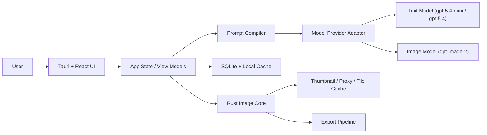

# GPT-Image-2 Windows Photo Editor

Version: v0.2
Date: 2026-05-17
Status: Draft, updated with MVP2 Social Landscape Edition

## 1. Document Purpose

This document consolidates the product requirements and detailed technical design for a Windows-first AI photo editing application built around `gpt-image-2`. The product is designed for photographers and image creators who work with large PNG images and want to perform prompt-driven edits efficiently on desktop.

The document covers:

- product goals and scope
- target users and usage scenarios
- feature requirements for the MVP and later phases
- technical architecture for a Windows-first, macOS-ready desktop application
- large-image processing strategy
- prompt compilation strategy
- data model, module design, and API abstraction
- UI approach based on `Tauri + React + shadcn/ui + Radix UI + Tailwind CSS`
- development milestones and risk assessment

## 2. Product Summary

### 2.1 Product Positioning

The product is an AI-assisted desktop photo editor focused on:

- prompt-based photo editing
- mask-based local edits
- large-image friendly workflows
- BYOK configuration with `baseURL + API key`
- photography-oriented editing rather than pure AI image generation

It is not positioned as a full replacement for Photoshop, Capture One, or Lightroom in traditional RAW and pixel-level workflows. Instead, it focuses on "content-aware AI editing" on top of a local desktop workflow.

### 2.2 Core Value

The product should help users quickly complete edits such as:

- removing unwanted people or objects
- repairing sky, clouds, water, vegetation, and background details
- changing atmosphere, season, or weather
- adjusting visual tone through prompt-driven edits
- applying edits to high-resolution source images without losing the local-desktop workflow

### 2.3 Platform Strategy

Phase 1 targets Windows.

The architecture must remain compatible with a future macOS release by using:

- `Tauri 2` for the desktop shell
- `React + TypeScript` for UI
- `Rust` for native image-processing modules
- `libvips` for large image handling

## 3. Product Goals

### 3.1 Goals

- Provide a usable Windows desktop application for prompt-based image editing.
- Support large PNG photography assets, often around `36MB` per image.
- Minimize upload cost and latency by editing proxy images or local regions when possible.
- Support both global edit mode and mask-based local edit mode.
- Allow users to configure `baseURL`, `API key`, and model settings locally.
- Default to a client-direct BYOK architecture without requiring a server.
- Support a future macOS version without major architectural rework.

### 3.2 Non-Goals for MVP

- RAW pipeline support
- advanced color grading curves
- frequency separation or precision retouching tools
- Photoshop-grade layer compositing
- multi-user collaboration
- cloud sync
- billing, quota management, or team administration
- plugin marketplace

## 4. Target Users

### 4.1 Primary Users

- photographers
- wedding and portrait editors
- landscape photographers
- content creators managing large photo libraries

### 4.2 User Characteristics

- work with large local image files
- want faster iteration than manual compositing
- may not want to run a self-hosted backend
- may prefer using their own model provider credentials

## 5. Core Use Cases

### 5.1 General Use Cases

- import a folder of large PNG images
- browse thumbnails quickly
- open a single image for inspection and editing
- paint a mask over a region
- enter a prompt such as "remove the tourists and keep the water reflection natural"
- generate a draft result quickly
- compare before and after
- accept the result and export the image
- generate a brand-new image from a text prompt without an input photo (see [§31](#31-image-generation-mode))

### 5.2 Landscape Photo Use Cases

- remove power lines, people, signs, boats, trash bins
- enhance clouds and sky texture while preserving realism
- add fog or sunrise atmosphere
- clean the frame edges and foreground clutter
- repair local areas such as water reflections or mountain texture

### 5.3 Portrait and Event Use Cases

- remove distracting background objects
- repair clothing wrinkles or missing details
- replace minor scene elements
- preserve face shape, skin tone, pose, and dress texture

## 6. Product Scope

### 6.1 MVP Features

- local image import from folders
- thumbnail generation and browsing
- single-image viewer
- zoom and pan
- brush-based mask editing
- prompt input panel
- AI edit action with draft and final quality presets
- side-by-side compare view
- history of edit versions per image
- export to PNG or JPEG
- settings page with `baseURL`, `API key`, image model, and text model
- text-to-image generation mode with persistent gallery (see [§31](#31-image-generation-mode))

### 6.2 MVP2 Social Landscape Edition

MVP2 focuses on real personal use rather than commercial high-fidelity delivery:

- primary scenario: landscape photography
- secondary scenario: light portrait retouching
- target output: social sharing, especially WeChat Moments and mobile viewing
- acceptable output file size: usually `5MB` to `8MB`
- preferred workflow: compressed upload proxy editing, not original-size crop-stitch editing

MVP2 features:

- configurable upload proxy quality profiles
- default recommended edit proxy around `4096px` long edge and `<=8MB`
- keep image edit API `size` as `auto`; do not expose 1K, 2K, or 4K controls during editing
- social export presets such as WeChat Moments, high-quality mobile, and custom JPEG
- landscape prompt presets for natural clarity, sky detail, sunset glow, cool blue tone, mountain texture, water reflection, green recovery, and night scene cleanup
- light portrait presets focused on natural skin, identity preservation, background cleanup, and soft atmosphere
- reusable prompt presets and prompt history
- small batch edit queue for selected photos using the same prompt or preset
- better before/after comparison for color, detail, and composition review
- Rust-side provider compatibility check to avoid frontend CORS issues
- Windows Credential Manager or equivalent secure key storage before public beta

MVP2 explicitly does not prioritize original-resolution crop-stitch editing. Crop-stitch remains valuable for future professional local repair, but it can create visible seams and is not necessary for the current social-sharing target.

See [§32](#32-mvp2-social-landscape-edition) for detailed requirements.

### 6.3 Post-MVP Features

- region auto-detection
- smart prompt suggestions
- reference-image-based edits
- project folders and tags
- original-resolution crop-stitch local repair
- RAW workflow support
- macOS build and distribution
- optional hosted relay service

## 7. Key Product Decisions

### 7.1 No Server Required for Phase 1

The initial architecture should not require an application server.

The desktop client will:

- store configuration locally
- call the text model directly
- call the image editing model directly
- process large images locally
- maintain local history and metadata

This reduces implementation complexity and makes early iteration faster.

### 7.2 BYOK Architecture

Users will configure:

- `baseURL`
- `API key`
- image model name
- text model name

The client should support OpenAI-compatible APIs where feasible, but the first implementation should be validated primarily against OpenAI-compatible image edit flows.

### 7.3 Text Model Choice

The default prompt-compilation model should be `gpt-5.4-mini`.

Rationale:

- it is sufficient for prompt rewriting and constraint expansion in most editing tasks
- it keeps cost and latency low
- image editing cost and latency are the main bottleneck, not prompt compilation

`gpt-5.4` should be used as an optional fallback for:

- highly complex prompts
- multiple failed retries
- stricter portrait or identity-preservation scenarios
- multi-reference edit planning

### 7.4 UI Stack Choice

The chosen UI approach is:

- `Tauri 2`
- `React`
- `TypeScript`
- `Tailwind CSS`
- `shadcn/ui`
- `Radix UI`

This stack is selected because it provides:

- high visual quality
- strong control over desktop-like layouts
- accessible primitives
- enough flexibility to build a premium creative-tool interface

## 8. User Experience Principles

### 8.1 Design Direction

The application should feel like a creative desktop tool, not a generic admin panel.

The interface should emphasize:

- strong visual hierarchy
- calm, low-distraction editing surfaces
- clear separation between asset library, canvas, and prompt controls
- fast access to history and compare views

### 8.2 UX Priorities

- opening large images must feel fast
- AI edits must start from draft mode for quick iteration
- users should always understand what area is being edited
- prompts should be assisted, not hidden
- failed jobs should be recoverable

## 9. Functional Requirements

### 9.1 Asset Import

- user can select one or more local folders
- app indexes supported image files
- app stores references without duplicating originals
- app generates local thumbnails and preview proxies
- app detects file modification timestamps and refreshes metadata when needed

### 9.2 Library View

- grid of thumbnails
- sort by filename, modified time, import time
- filter by status such as unedited, edited, exported
- quick preview on selection

### 9.3 Viewer and Canvas

- open a single image into an editor view
- zoom and pan smoothly
- show image dimensions and file size
- support before/after toggle
- support split compare mode

### 9.4 Mask Tools

- brush tool
- erase tool
- adjustable size and softness
- show mask overlay
- invert mask
- clear mask

### 9.5 Prompt Panel

- free-text prompt input
- prompt history
- optional prompt presets
- advanced constraints toggle
- quick actions such as:
  - preserve face and identity
  - preserve clothing texture
  - preserve composition
  - keep realistic lighting

### 9.6 AI Edit

- user chooses draft or final mode
- app compiles a structured edit instruction
- app chooses the appropriate source payload:
  - full preview proxy
  - local region crop with mask
- app submits edit request
- app displays progress and cancel option
- app stores result as a new version

### 9.7 Version History

- every accepted result becomes a version entry
- user can switch among versions
- user can compare prompt, timestamp, model, and mode

### 9.8 Export

- export current version to PNG
- export current version to JPEG
- export to chosen directory
- preserve original image separately

### 9.9 Settings

- configure `baseURL`
- configure `API key`
- configure default image model
- configure default text model
- configure optional fallback text model
- configure cache directory and proxy quality

## 10. Non-Functional Requirements

### 10.1 Performance

- application should open large local images quickly through proxy rendering
- thumbnail browsing should not require loading full-resolution images
- local cropping and compositing should complete within desktop-acceptable latency

### 10.2 Reliability

- original files must never be overwritten silently
- edits must be versioned
- failures must not corrupt local metadata

### 10.3 Security

- API keys must be stored securely, not in plaintext project files
- logs must avoid leaking secrets
- app should warn users when using custom providers with unknown compatibility

### 10.4 Cross-Platform Readiness

- file and path logic must avoid Windows-only assumptions in core modules
- keyboard shortcuts should be abstracted
- native-specific capabilities must be isolated behind adapters

## 11. High-Level Architecture

### 11.1 Overview

The application uses a local-first desktop architecture:

1. UI layer manages library, canvas, prompt entry, and settings.
2. Native image core manages large-image preprocessing, tiling, crop extraction, and compositing.
3. Provider layer handles text-model and image-model requests.
4. Local persistence stores metadata, versions, and settings.

### 11.2 Architecture Diagram



## 12. Module Breakdown

### 12.1 Desktop Shell

Responsibilities:

- window lifecycle
- native menus
- file dialogs
- secure storage bridge
- filesystem permissions

Technology:

- `Tauri 2`

### 12.2 UI Layer

Responsibilities:

- layout and routing
- editor panels
- prompt interactions
- settings forms
- compare mode

Technology:

- `React`
- `TypeScript`
- `Tailwind CSS`
- `shadcn/ui`
- `Radix UI`

### 12.3 State Management

Responsibilities:

- selected asset
- current editor state
- active mask
- prompt draft
- job progress
- version selection

Recommended options:

- `Zustand` for app state
- `TanStack Query` for async job orchestration where useful

### 12.4 Image Core

Responsibilities:

- read source metadata
- build thumbnails and preview proxies
- extract local crop regions
- normalize mask images
- stitch returned results back into the source image
- blend crop boundaries

Technology:

- `Rust`
- `libvips`

### 12.5 Provider Adapter

Responsibilities:

- normalize requests to configured provider
- separate text and image request flows
- handle retry and timeout policies
- validate base URL and credentials

### 12.6 Persistence Layer

Responsibilities:

- local SQLite metadata
- prompt history
- version history
- cache index
- user preferences

### 12.7 Secure Secret Storage

Responsibilities:

- securely store API key
- optionally store per-provider credentials

Preferred strategy:

- Tauri secure storage or stronghold-backed storage
- never store plaintext key inside SQLite

## 13. Large Image Strategy

This is one of the most critical design areas.

### 13.1 Problem

Source images may be large PNG files around `36MB`, often with dimensions too large or too expensive for repeated whole-image uploads.

### 13.2 Strategy

Use a local proxy-first editing pipeline. For MVP1 and MVP2, the preferred path is whole-image proxy editing:

- keep original source locally and immutable
- generate an upload proxy from the source image before submitting an edit
- keep the edit API `size` parameter as `auto`
- do not require the user to select 1K, 2K, or 4K during editing
- tune proxy size and JPEG quality through internal quality profiles
- default MVP2 proxy target: around `4096px` long edge and `<=8MB`
- use the proxy for global edits and mask-based local edits
- save the returned result as the edited version
- expose user-facing size and quality choices at export time, not edit time

Original-resolution crop-stitch is deferred until a later professional local-repair phase. It should not be treated as MVP2-critical because the current target user accepts `5MB` to `8MB` social-sharing outputs, and crop-stitch can introduce visible seams when color, grain, or texture differs from the surrounding image.

### 13.3 Processing Levels

- thumbnail: library grid usage
- preview proxy: canvas display
- upload proxy: compressed edit input submitted to the provider
- export derivative: JPEG or PNG result optimized for social sharing
- source crop: future professional local-region edit

### 13.4 MVP2 Proxy-Based Edit Flow

1. user opens a large local PNG
2. app renders a preview proxy for smooth viewing
3. user enters a prompt or selects a landscape or portrait preset
4. user optionally paints a mask for local semantic editing
5. app creates an upload proxy according to the active quality profile
6. app resizes the mask to match the upload proxy when a mask exists
7. app submits proxy image, optional mask, compiled prompt, and `size=auto`
8. app saves the provider result as a new version
9. user reviews before/after and exports with a social preset

### 13.5 Future Crop-Stitch Requirements

Crop-stitch should be considered only when the product needs original-size local repair. The future flow is:

- map user mask coordinates back to source coordinates
- expand the bounding box with safety padding
- extract a source-resolution crop
- create a same-size crop mask
- submit crop + mask + compiled prompt
- blend the edited crop back into the original-size working image

Blending requirements:

- support feathered boundaries
- preserve unedited border pixels
- allow configurable overlap padding
- warn or fall back to proxy editing when the masked area is too large

## 14. Prompt Compilation Strategy

### 14.1 Why a Prompt Compiler Is Needed

Direct user prompts are often underspecified and unstable. A prompt compiler improves consistency and quality.

### 14.2 Prompt Compiler Responsibilities

- rewrite the user prompt into a structured edit instruction
- infer preservation constraints
- add realism requirements
- convert mask context into explicit local-edit instructions
- choose between global-style and local-repair framing

### 14.3 Default Text Model

- primary: `gpt-5.4-mini`
- fallback: `gpt-5.4`

### 14.4 Compiler Input

- user prompt
- edit mode
- image category such as landscape or portrait
- whether a mask exists
- optional protected regions
- user toggles such as preserve identity or preserve composition

### 14.5 Compiler Output Schema

```json
{
  "edit_goal": "Remove the people standing on the lakeshore.",
  "edit_scope": "local_masked_region",
  "preserve": [
    "overall composition",
    "mountain outline",
    "water reflection continuity",
    "natural color balance"
  ],
  "style_constraints": [
    "keep realistic landscape lighting",
    "avoid artificial textures"
  ],
  "negative_constraints": [
    "no extra people",
    "no warped shoreline",
    "no distorted reflections"
  ],
  "quality_mode": "draft"
}
```

### 14.6 Retry Strategy

If an image edit fails or produces poor output:

- keep the user prompt
- refine preservation and negative constraints
- optionally escalate compiler model to `gpt-5.4`
- retry with adjusted wording

## 15. Editing Modes

### 15.1 Global Edit Mode

Use cases:

- atmosphere shifts
- color mood changes
- season or weather feel
- broad aesthetic changes

Recommended behavior:

- operate on preview proxy first
- require explicit user confirmation for full-resolution follow-up

### 15.2 Local Mask Edit Mode

Use cases:

- remove people or objects
- repair background
- replace localized content
- clean image edges

Recommended behavior:

- prefer source crop workflow
- use same-size image and mask payloads
- blend result back into working image

### 15.3 Future Reference Edit Mode

Use cases:

- borrow sky style from another image
- preserve current composition while adopting reference texture or mood

This is post-MVP.

## 16. Provider and API Design

### 16.1 Provider Abstraction

Define two internal client interfaces:

```ts
interface TextModelClient {
  compilePrompt(input: PromptCompileInput): Promise<CompiledPrompt>;
}

interface ImageEditClient {
  editImage(input: ImageEditInput): Promise<ImageEditResult>;
}
```

### 16.2 BaseURL Strategy

The app should allow a configurable `baseURL`, but internally normalize:

- no trailing slash issues
- consistent timeout handling
- capability checks for image edit compatibility

### 16.3 Image Edit Request Object

```ts
interface ImageEditInput {
  imagePath: string;
  maskPath?: string;
  prompt: string;
  qualityMode: "draft" | "final";
  outputFormat: "png" | "jpeg";
  sourceKind: "preview_proxy" | "source_crop";
  metadata: {
    imageId: string;
    sourceWidth: number;
    sourceHeight: number;
    cropRect?: { x: number; y: number; width: number; height: number };
  };
}
```

### 16.4 Text Compile Request Object

```ts
interface PromptCompileInput {
  userPrompt: string;
  imageType: "landscape" | "portrait" | "event" | "generic";
  editMode: "global" | "local_mask";
  preserveIdentity: boolean;
  preserveComposition: boolean;
  maskPresent: boolean;
  qualityMode: "draft" | "final";
}
```

### 16.5 Compatibility Warning

Not all OpenAI-compatible providers implement image edit endpoints the same way. The app should:

- run a lightweight compatibility validation
- show provider warnings in settings
- clearly label unverified providers

## 17. Local Data Model

### 17.1 Storage Components

- SQLite database for metadata
- cache directory for thumbnails, proxies, masks, and temporary outputs
- secure storage for secrets

### 17.2 Suggested Tables

#### images

- `id`
- `source_path`
- `filename`
- `file_size`
- `width`
- `height`
- `checksum`
- `imported_at`
- `modified_at`

#### image_versions

- `id`
- `image_id`
- `parent_version_id`
- `version_type`
- `local_path`
- `prompt_text`
- `compiled_prompt_json`
- `image_model`
- `text_model`
- `created_at`

#### edit_jobs

- `id`
- `image_id`
- `version_id`
- `status`
- `mode`
- `crop_rect_json`
- `mask_path`
- `error_message`
- `started_at`
- `finished_at`

#### prompts

- `id`
- `image_id`
- `prompt_text`
- `compiled_prompt_json`
- `created_at`

#### app_settings

- `key`
- `value_json`

## 18. Cache Layout

Recommended local directory layout:

```text
app-data/
  db/
    app.sqlite
  cache/
    thumbs/
    proxies/
    masks/
    temp/
    jobs/
  exports/
```

## 19. UI Structure

### 19.1 Main Screens

- generate screen
- library screen
- editor screen
- settings screen

### 19.2 Editor Layout

Recommended three-column layout:

- left: image browser and version list
- center: main canvas
- right: prompt panel, mask controls, job controls

### 19.3 Key UI Components

- `Sidebar` from shadcn patterns for navigation
- `Dialog` and `Popover` from Radix for prompt helpers and settings
- `Tabs` for mode switching between prompt, mask, history
- `Sheet` or right panel for advanced controls
- `Toast` for job status and failure feedback

### 19.4 Visual Style Guidance

- dark-neutral canvas area
- soft-contrast panels
- restrained accent color
- typography optimized for tool readability
- avoid admin-dashboard appearance

## 20. Recommended Frontend Project Structure

```text
src/
  app/
  components/
    ui/
    library/
    editor/
    settings/
  features/
    assets/
    editing/
    prompting/
    versions/
    jobs/
  stores/
  hooks/
  services/
    provider/
    prompt/
    jobs/
  types/
  utils/
src-tauri/
  src/
    main.rs
    commands/
    image_core/
    storage/
    provider/
```

## 21. Core Workflows

### 21.1 Import Workflow

1. user selects folder
2. app scans supported images
3. metadata saved to SQLite
4. thumbnail and proxy generation queued
5. library view updates progressively

### 21.2 Local Edit Workflow

1. user opens image
2. user paints mask
3. user enters prompt
4. prompt compiler creates structured instruction
5. image core extracts source crop and mask
6. image request submitted
7. result blended into working version
8. version saved and compare view refreshed

### 21.3 Global Edit Workflow

1. user opens image
2. user enters global prompt
3. prompt compiler creates full-image instruction
4. preview proxy submitted first
5. draft result shown
6. user optionally requests final output
7. final version saved

## 22. Error Handling

### 22.1 Failure Categories

- invalid API key
- unsupported provider capability
- network timeout
- provider rate limit
- image too large for selected flow
- mask mismatch
- corrupt local cache

### 22.2 UX Requirements for Errors

- errors must be actionable
- preserve draft prompt and mask when a job fails
- allow retry with one click
- distinguish provider errors from local processing errors

## 23. Security and Privacy

### 23.1 Secrets

- API keys stored in secure storage only
- never display full keys after initial save
- redact keys in logs

### 23.2 Local Images

- originals remain local
- edited proxies and outputs remain local unless explicitly exported or uploaded for edit requests

### 23.3 Provider Disclosure

- show clear notice that selected image regions are uploaded to the configured provider for processing

## 24. Packaging and Distribution

### 24.1 Windows

- package as installer or portable package through Tauri build
- target modern Windows desktop environment

### 24.2 Future macOS

- same codebase should build for macOS
- final mac build must be produced on a Mac
- signing and notarization are post-MVP release concerns

## 25. Testing Strategy

### 25.1 Unit Tests

- prompt compiler formatting
- crop rectangle math
- coordinate mapping between proxy and source
- version graph logic

### 25.2 Integration Tests

- import and cache generation
- provider request formation
- local stitch workflow
- export pipeline

### 25.3 Manual QA Focus

- large PNG browsing responsiveness
- local mask alignment
- landscape repair quality
- portrait preservation constraints
- provider compatibility edge cases

## 26. MVP Milestones

### Milestone 1: Foundation

- Tauri shell
- React UI skeleton
- settings and secure key storage
- folder import
- thumbnail generation

### Milestone 2: Editor Core

- image viewer
- zoom and pan
- mask tools
- prompt panel

### Milestone 3: AI Pipeline

- prompt compiler with `gpt-5.4-mini`
- image edit adapter for `gpt-image-2`
- draft and final modes
- version history

### Milestone 4: Export and Stability

- export flow
- retry and error handling
- cache cleanup
- performance tuning

### Milestone 5: Beta Readiness

- polish UI
- provider compatibility checks
- presets and prompt history
- test pass on representative large-image set

## 27. Future Roadmap

### 27.1 Product Expansion

- larger batch queue with scheduling and retry policies
- original-resolution crop-stitch local repair
- region auto-detection for local repairs
- reference image mode
- smart auto-mask suggestions
- project folders, tags, and search

### 27.2 Deployment Expansion

- macOS release
- optional relay service mode
- optional hosted account system

## 28. Risks and Mitigations

### Risk 1: Provider Compatibility Variance

Mitigation:

- build against a verified default provider profile
- add compatibility checks and warnings

### Risk 2: Large-Image Latency

Mitigation:

- proxy-first workflow
- configurable upload proxy profiles
- keep edit size as `auto`
- expose size and quality at export time
- separate draft and final modes

### Risk 2.1: Detail Loss From Compression

Mitigation:

- default MVP2 to a higher-quality social proxy, around `4096px` long edge and `<=8MB`
- keep JPEG quality high enough for landscape gradients, clouds, water, and foliage
- provide a high-quality sharing profile for users who prefer larger output files
- make it clear that MVP2 targets social sharing, not commercial original-resolution delivery

### Risk 3: Unstable Edit Output

Mitigation:

- prompt compiler
- preservation constraints
- retry escalation from `gpt-5.4-mini` to `gpt-5.4`

### Risk 4: UI Complexity

Mitigation:

- keep MVP focused on library, editor, prompt, versions, export
- postpone advanced features such as batch mode and references

## 29. Build Recommendation

The recommended implementation path is:

1. build a Windows-first BYOK desktop application
2. use local-first proxy and crop workflows to handle large PNG files
3. default the prompt compiler to `gpt-5.4-mini`
4. use `gpt-image-2` for image editing
5. avoid introducing a server in the MVP
6. keep the architecture ready for a later macOS build

## 30. Suggested Next Artifacts

After this document, the next recommended deliverables are:

- clickable low-fidelity wireframes
- database schema file
- provider adapter interface definitions
- prompt compiler prompt templates
- task breakdown for the first implementation sprint

## 31. Image Generation Mode

### 31.1 Purpose

In addition to prompt-based editing of existing photographs, Photonix supports text-to-image generation. This lets users create new images from scratch when no source photo exists, for moodboards, concept exploration, social posts, or generating reference imagery to feed back into the edit pipeline.

This is a first-class mode rather than a buried feature. It has its own top-level screen so the workflow stays focused and does not pollute the photo library with synthetic results.

### 31.2 Goals

- give users a fast path from idea to image without importing anything
- keep generated images separate from imported photos
- persist generation history across app restarts
- reuse the same provider configuration as edit mode
- stay consistent with the rest of the app in style, BYOK posture, and security boundaries

### 31.3 Non-Goals

- batch generation in MVP
- prompt enhancement or auto-rewriting through the prompt compiler in MVP
- image-to-image variation in MVP
- moving generated results into the imported library automatically

### 31.4 User Flow

1. user opens the Generate screen from the left navigation
2. user types a prompt and selects size and quality
3. user clicks Generate, or presses Ctrl/Cmd + Enter
4. progress is shown in the bottom gallery strip while the request is in flight
5. on success, the new image is prepended to the gallery and shown in the preview area
6. user can export the selected generation as PNG, or delete it from the gallery

### 31.5 Functional Requirements

#### 31.5.1 Prompt Input

- multi-line free-text prompt input
- size selection: square, wide, tall, auto
- quality selection: standard, hd, auto
- a small set of starter prompts users can click to populate the textarea
- Ctrl/Cmd + Enter as a keyboard shortcut for Generate

#### 31.5.2 Gallery

- horizontal strip of all previously generated images, newest first
- click thumbnail to load it into the preview area
- delete button on hover removes both the database row and the disk file
- a placeholder tile appears at the head of the strip while a generation is in flight

#### 31.5.3 Preview

- shows the currently selected generation full-size with object-contain scaling
- displays the prompt, dimensions, size, and quality used for that generation
- exposes an Export PNG action for the selected image

#### 31.5.4 Persistence

- each generation is stored as a PNG in the application data directory
- a database row records prompt, size, quality, dimensions, file size, and creation timestamp
- gallery state is restored on app launch from the database

#### 31.5.5 Errors

- provider errors are surfaced with the upstream error message when available
- missing API key produces an actionable hint pointing to Settings
- network and decode errors do not corrupt the gallery or database

### 31.6 UI Layout

The Generate screen uses a three-zone layout inside the main content area:

```text
+-----------------------------------------------------------------------------------+
| Top Bar                                                                            |
+-----------------------------------------------------------------------------------+
| Sidebar (Generate at top) | Preview Area                       | Prompt Panel       |
|                           |                                     |                    |
|                           |   Selected generation (large)       |  prompt textarea   |
|                           |   prompt | size | quality | export  |  size buttons      |
|                           +-------------------------------------|  quality buttons   |
|                           | Gallery Strip (horizontal scroll)   |  Generate button   |
|                           | [thumb] [thumb] [thumb] ...         |  quick prompts     |
+-----------------------------------------------------------------------------------+
| Bottom Status Bar                                                                  |
+-----------------------------------------------------------------------------------+
```

### 31.7 Architecture and Module Mapping

The frontend module layout follows the existing convention:

```text
src/
  components/
    generate/
      GenerateScreen.tsx
      GeneratePromptPanel.tsx
      GenerateGallery.tsx
      GeneratePreview.tsx
  stores/
    generateStore.ts
  services/
    tauri/
      generate.ts
```

The Rust side adds:

```text
src-tauri/src/
  commands/
    generate.rs
```

### 31.8 Backend Command Interface

#### 31.8.1 generate_image

Submits a generation request to the configured provider, downloads or decodes the result, persists it, and returns the new row.

Input:

```rust
pub struct GenerateImageRequest {
    pub prompt: String,
    pub size: String,
    pub quality: String,
    pub base_url: String,
    pub api_key: String,
    pub image_model: String,
}
```

Output:

```rust
pub struct GenerateImageResult {
    pub success: bool,
    pub image: Option<GeneratedImageRow>,
    pub error: Option<String>,
}
```

Behavior:

- POSTs to `{base_url}/images/generations`
- explicitly requests `response_format: b64_json` to avoid URL expiry
- falls back to async URL download if the provider only returns a `url`
- saves bytes to `app_data/generations/<uuid>.png`
- inserts a row into `generated_images`
- returns the row to the frontend

#### 31.8.2 list_generated_images

Returns all rows from `generated_images` ordered by `created_at DESC`. Used by the Generate screen on mount.

#### 31.8.3 delete_generated_image

Deletes the row by id and best-effort removes the underlying PNG file.

### 31.9 Data Model

#### 31.9.1 Table: generated_images

| Field           | Type     | Notes                                         |
|-----------------|----------|-----------------------------------------------|
| id              | TEXT PK  | UUID                                          |
| storage_path    | TEXT     | absolute path to PNG in `app_data/generations/` |
| prompt          | TEXT     | full user prompt                              |
| size            | TEXT     | size value used in the request                |
| quality         | TEXT     | quality value used in the request             |
| width           | INTEGER  | actual returned width                         |
| height          | INTEGER  | actual returned height                        |
| file_size_bytes | INTEGER  | optional, size of the saved file              |
| created_at      | TEXT     | timestamp                                     |

Indexed by `created_at` for fast newest-first listing.

This table is added through migration `002_generated_images`. The migration runner skips it on databases that already have it, so existing installations upgrade transparently.

#### 31.9.2 Disk Layout

```text
app-data/
  generations/
    <uuid>.png
    <uuid>.png
    ...
```

Generations are intentionally stored separately from `versions/` so they cannot accidentally be treated as edits of an imported photo, and so the user can wipe synthetic content without affecting their photo library.

### 31.10 Provider Compatibility

- the request shape matches the OpenAI Images Generations API
- non-OpenAI providers must accept `model`, `prompt`, `size`, `quality`, `n`, `response_format` and return `data[0].b64_json` or `data[0].url`
- the same `image_model` configured for edit mode is reused
- the same API key, base URL, and Settings flow are reused with no additional configuration

If a provider does not support generation, it surfaces as a normal provider error and is shown to the user.

### 31.11 Security and Privacy

- the API key is loaded from secure storage on demand and never enters the JS layer in plaintext
- generated content stays local until the user explicitly exports it
- prompts are stored in the local database only and are never sent anywhere except the configured provider URL

### 31.12 Cross-Mode Interactions

For MVP, the Generate screen is independent from the Library and Editor screens. Users can manually export a generation and re-import the resulting PNG through Library if they want to use it as input for an edit. Direct hand-off from generation to the edit pipeline is post-MVP.

### 31.13 Future Enhancements

- pass a generation directly into the editor as a working image
- prompt enhancement through the same prompt compiler used for edits
- batch queue for parallel generations
- image-to-image variation seeded from a selected generation
- per-generation tags, search, and pinning
- bulk export of selected generations

## 32. MVP2 Social Landscape Edition

### 32.1 Purpose

MVP2 turns Photonix from a technically working single-image AI editor into a practical daily tool for personal photography. The target user mainly edits landscape photos, occasionally edits portraits, and wants good-looking results for WeChat Moments and mobile social sharing rather than commercial original-resolution delivery.

The product direction for MVP2 is:

- make large PNG editing fast and predictable
- prioritize visual quality at `5MB` to `8MB` social-sharing output sizes
- avoid unnecessary original-file uploads
- avoid premature original-resolution crop-stitch complexity
- make landscape enhancement feel guided, repeatable, and tasteful

### 32.2 User Profile

Primary user:

- shoots or collects large landscape PNG photos
- wants fast AI-assisted edits without opening heavyweight professional tools
- shares finished photos on WeChat Moments or similar mobile social channels
- accepts high-quality compressed output instead of original-resolution delivery

Secondary user:

- occasionally edits portraits or travel photos
- wants natural light retouching, not commercial beauty retouching
- cares about preserving face identity, skin tone, pose, and clothing texture

### 32.3 Product Goal

MVP2 should help a user go from a folder of large photos to several polished social-ready images in minutes.

Success means:

- large images open smoothly
- edits do not upload 36MB source PNG files
- landscape presets produce usable first attempts
- users can batch-process several photos with one preset
- exported images are visually strong on mobile and usually fit within `5MB` to `8MB`
- the app feels safer and more reliable than MVP1

### 32.4 Non-Goals

MVP2 does not include:

- RAW processing
- Lightroom-style color grading panels
- Photoshop-grade layer editing
- original-resolution crop-stitch as the default workflow
- commercial portrait retouching workflows
- cloud accounts, billing, or hosted relay service
- macOS release package, although architecture must remain macOS-ready

### 32.5 Key Product Decisions

#### 32.5.1 Editing Should Use Proxy Inputs

The app should continue using compressed upload proxy images for AI editing.

Rationale:

- uploading 36MB PNG files is slow and wasteful for social-sharing output
- the model mainly needs semantic, tonal, and compositional context
- mobile platforms compress images again during sharing
- proxy-based editing is simpler and more reliable than crop-stitch for MVP2

Recommended default:

- long edge: around `4096px`
- target file size: `<=8MB`
- JPEG quality: start around `90`, avoid dropping below `78` unless necessary

#### 32.5.2 Edit Size Should Stay Automatic

The edit request should keep `size=auto`.

Do not expose 1K, 2K, or 4K choices in the edit panel because:

- fixed output size selection interrupts the creative flow
- provider-supported sizes are limited and not equivalent to arbitrary 2K or 4K output
- the user cares more about output usefulness than API-level dimensions
- dimension and file-size choices belong in export, not editing

#### 32.5.3 Export Is Where Quality Choices Belong

MVP2 should expose social-friendly export presets:

- WeChat Moments recommended
- high-quality mobile
- small file
- custom JPEG
- PNG export for lossless local archive when needed

Export options should control:

- format: JPEG or PNG
- JPEG quality
- optional long-edge resize
- estimated output file size when feasible

### 32.6 Functional Requirements

#### 32.6.1 Upload Proxy Quality Profiles

Add settings for edit proxy generation:

| Profile | Long Edge | Target Size | JPEG Quality Floor | Use Case |
|---------|-----------|-------------|--------------------|----------|
| Fast | `3072px` | `<=5MB` | `68` | quick drafts and unstable networks |
| Recommended | `4096px` | `<=8MB` | `78` | default landscape and social sharing |
| High Quality | `5120px` | `<=12MB` | `82` | more detail, slower upload |

Default profile for MVP2: `Recommended`.

The profile should affect only the upload proxy. It should not mutate the original source file.

#### 32.6.2 Landscape Presets

Add first-class landscape presets in the prompt panel:

- Natural Clarity: enhance contrast and local detail while avoiding over-HDR
- Sunset Glow: warmer highlights, richer sky, preserved natural shadows
- Cool Blue Tone: clean blue-hour or city-night mood
- Sky Detail: recover cloud texture without fake dramatic artifacts
- Mountain Texture: improve distant ridge and rock detail naturally
- Water Reflection: improve water clarity and reflections without plastic texture
- Green Recovery: restore natural greens without neon saturation
- Night Cleanup: reduce noise, improve light separation, preserve atmosphere

Each preset should provide:

- display name
- short description
- prompt template
- recommended preserve-composition setting
- recommended preserve-identity setting when relevant

#### 32.6.3 Light Portrait Presets

Add light portrait presets:

- Natural Skin: improve skin tone gently, avoid waxy smoothing
- Background Cleanup: remove distractions while preserving the person
- Soft Atmosphere: improve lighting and background mood
- Identity Safe Retouch: preserve face shape, age, expression, and skin texture

Portrait presets must emphasize:

- preserve identity
- preserve clothing and pose
- avoid unrealistic beauty filters
- avoid changing age, face shape, or expression unless explicitly requested

#### 32.6.4 Prompt History and User Presets

MVP2 should persist:

- raw user prompts
- compiled prompts when available
- selected preset
- quality mode
- created timestamp
- image id or version id when the prompt was used

Users should be able to:

- reuse a previous prompt
- save a prompt as a custom preset
- rename a custom preset
- delete a custom preset

#### 32.6.5 Small Batch Edit Queue

Add a lightweight batch edit feature for selected images.

MVP2 batch scope:

- select multiple images from Library
- choose one preset or write one prompt
- process images sequentially or with very low concurrency
- show queue status for each item
- allow canceling pending jobs
- allow retrying failed jobs
- save each successful result as a new version

Recommended initial concurrency: `1`, with future option for `2`.

Batch edit should reuse:

- current provider settings
- current upload proxy profile
- same prompt compiler
- same image edit pipeline

#### 32.6.6 Better Comparison Tools

Improve before/after review:

- slider comparison
- side-by-side comparison
- quick toggle between original and edited version
- zoom-aware comparison when feasible
- display version metadata such as preset, prompt, proxy profile, and created time

Landscape users need to judge color, sky, water, and texture quickly, so comparison should be visually central, not hidden.

#### 32.6.7 Social Export Presets

Add export presets:

| Preset | Format | Long Edge | Quality | Goal |
|--------|--------|-----------|---------|------|
| WeChat Moments | JPEG | `4096px` or original result size if smaller | `90` | good mobile quality and manageable file size |
| High Quality Mobile | JPEG | `5120px` or original result size if smaller | `92` | more detail, larger file |
| Small File | JPEG | `2560px` | `85` | fast sharing |
| Archive PNG | PNG | no resize by default | lossless | local keeping |

The UI should frame these as user goals, not technical output sizes.

#### 32.6.8 Rust-Side Compatibility Check

Move provider compatibility checks fully to Rust.

Reason:

- frontend `fetch` can fail because of CORS
- the existing API calls already happen in Rust
- compatibility should test the same networking environment as real edit requests

Compatibility check should verify:

- base URL reachable
- configured text model appears available or can respond to a minimal request
- configured image model appears available when provider exposes model listing
- actionable error if provider does not support model listing

#### 32.6.9 Secure Key Storage Upgrade

Before broader beta distribution, replace XOR-obfuscated key files with platform secure storage.

Windows target:

- Windows Credential Manager

Future macOS target:

- Keychain or Tauri Stronghold-compatible secure storage

SQLite must not store plaintext API keys.

### 32.7 UX Requirements

#### 32.7.1 Prompt Panel Changes

The prompt panel should contain:

- free-text prompt area
- preset group: Landscape
- preset group: Portrait
- recently used prompts
- custom presets
- edit mode: draft or final if retained
- upload proxy profile indicator
- start edit button

Do not add visible 1K, 2K, or 4K edit-size buttons.

#### 32.7.2 Settings Changes

Settings should add:

- upload proxy profile
- export default preset
- provider compatibility test
- secure key storage status
- cache cleanup action

Settings copy should explain:

- original files stay untouched
- edit requests use compressed proxy images
- social sharing profile prioritizes speed and mobile visual quality

#### 32.7.3 Library Changes

Library should support:

- multi-select
- batch edit entry point
- filter by edited or unedited if simple to implement
- visible processing state for batch jobs

#### 32.7.4 Export Panel Changes

Export panel should prioritize presets:

- WeChat Moments
- High Quality Mobile
- Small File
- Archive PNG
- Custom

Advanced fields can be hidden behind a custom option.

### 32.8 Technical Design

#### 32.8.1 Upload Proxy Configuration

Add a local setting object:

```ts
type UploadProxyProfile = "fast" | "recommended" | "high_quality";

interface UploadProxyConfig {
  profile: UploadProxyProfile;
  maxLongEdge: number;
  maxBytes: number;
  startJpegQuality: number;
  minJpegQuality: number;
}
```

Rust should resolve the selected profile before creating the upload proxy.

#### 32.8.2 Edit Request Contract

Keep the edit request simple:

```ts
interface SubmitEditRequest {
  image_id: string;
  source_path: string;
  mask_path?: string;
  prompt: string;
  quality_mode: "draft" | "final";
  upload_proxy_profile?: "fast" | "recommended" | "high_quality";
  base_url: string;
  api_key: string;
  image_model: string;
}
```

The Rust command should:

- read the original source path
- generate an upload proxy according to profile
- resize mask to match upload proxy when present
- submit `size=auto`
- save result as a version
- record output dimensions and file size

#### 32.8.3 Preset Data Model

Built-in presets can be static JSON or TypeScript constants:

```ts
interface EditPreset {
  id: string;
  category: "landscape" | "portrait" | "custom";
  name: string;
  description: string;
  promptTemplate: string;
  preserveIdentity: boolean;
  preserveComposition: boolean;
  createdAt?: string;
  updatedAt?: string;
}
```

Custom presets should persist locally in SQLite.

#### 32.8.4 Batch Job Data Model

MVP2 can reuse or extend the existing `edit_jobs` concept:

```ts
type BatchJobStatus = "queued" | "running" | "succeeded" | "failed" | "canceled";

interface BatchEditItem {
  id: string;
  imageId: string;
  sourcePath: string;
  prompt: string;
  presetId?: string;
  status: BatchJobStatus;
  resultVersionId?: string;
  error?: string;
}
```

The first implementation can keep queue execution in the app process. Persistent queue recovery can be improved later.

### 32.9 MVP2 Milestones

#### Milestone 1: Proxy Quality Profiles

- make upload proxy parameters configurable
- add fast, recommended, and high-quality profiles
- default to recommended profile
- verify `size=auto` remains unchanged for edits

#### Milestone 2: Social Export

- add export presets
- implement long-edge resize during export
- implement JPEG quality presets
- show clear success and file path feedback

#### Milestone 3: Landscape and Portrait Presets

- add preset data structure
- add built-in landscape presets
- add built-in light portrait presets
- wire presets into prompt compilation
- save recent prompt usage

#### Milestone 4: Prompt History and Custom Presets

- add SQLite tables or app settings for prompt history and custom presets
- show recent prompts in the prompt panel
- allow save, rename, and delete custom presets

#### Milestone 5: Small Batch Queue

- add multi-select in Library
- add batch edit dialog
- run selected images through the existing edit pipeline
- display queued, running, succeeded, failed, and canceled states
- support retry for failed items

#### Milestone 6: Beta Hardening

- move compatibility checks to Rust
- upgrade Windows API key storage
- improve errors and logs
- test with representative large landscape folders
- tune default proxy and export settings based on real images

### 32.10 Acceptance Criteria

MVP2 is done when:

- a user can import a folder of large PNG landscape photos
- default edit uploads a compressed proxy, not the original 36MB PNG
- recommended proxy profile produces visually acceptable landscape results
- user can apply at least eight landscape presets
- user can apply at least four light portrait presets
- user can save and reuse custom prompts
- user can select multiple photos and batch edit them with one preset
- user can export using a WeChat Moments preset
- exported social images are usually within the `5MB` to `8MB` target range
- API key is stored with production-grade Windows secure storage before beta release
- compatibility check works from Rust without frontend CORS failure

### 32.11 Deferred From MVP2

The following remain future work:

- original-resolution crop-stitch repair
- automatic region detection
- reference-image editing
- RAW workflow
- commercial portrait retouching
- macOS signed and notarized release
- hosted relay service
